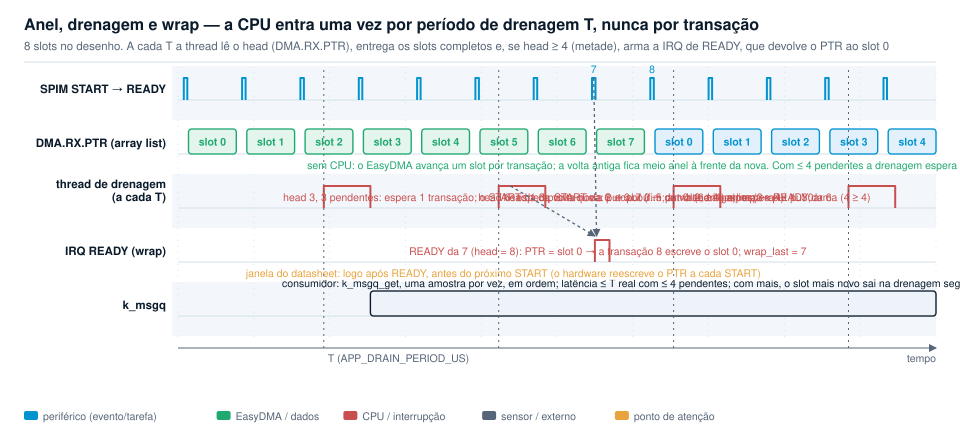

# dppi_works — aquisição SPI sem CPU com DPPI (nRF5340, nRF54L15)

**Em uma frase:** um evento de hardware (o data-ready do sensor ou um TIMER)
dispara a SPIM por DPPI e o EasyDMA grava cada rajada em RAM; a CPU entra
de um de dois jeitos, à escolha do projeto: uma thread acorda a cada período
de drenagem T (10 ms por padrão) e passa as amostras de um anel a uma fila
(modo drenado, o padrão), ou a interrupção `END` da SPIM copia cada amostra
para a fila assim que ela termina (modo por amostra). Com sensor real,
medido até 1 600 Hz por data-ready com zero perdas nos dois modos; os tetos
de barramento, medidos com disparo por TIMER, são 71,4 k transações/s no
nRF5340 (11 B) e 52,6 k/s no nRF54L15 (17 B).

**Tem uma pergunta concreta?** Vá direto aos
[exemplos resolvidos](#exemplos-resolvidos) (BMI270 a 1 600 Hz, ADXL382 a
64 kHz nos dois SoCs, sensor sem data-ready a 16 kHz).

Este caminho é para **taxa alta**. Os resultados com sensor real vão até
1 600 Hz, o ODR máximo dos sensores disponíveis; acima disso a bancada usa o
disparo por TIMER. O repositório vale a partir de ~1 k amostras/s e é
indispensável acima de ~10 k/s, onde uma leitura por chamada satura a CPU;
abaixo de ~1 k/s um produto usa o subsistema de sensores do Zephyr ou
leituras SPI diretas.

Os exemplos usam o DPPI (nRF53/54); o mesmo desenho vale com PPI no nRF52,
não testado. nRF Connect SDK v3.4.1 (nrfx 4.0), chip select por hardware.
Validado na Thingy:53 (nRF5340 + ADXL362) e na nRF54L15 TAG da Nordic
(placa Zephyr `nrf54l15tag`, com BMI270 a bordo), nos cores Cortex-M33 e
FLPR.

Marcação de todo número deste repositório: **M** = medido (log em
`*/test-logs/`, salvo onde se diz que o log não está incluído), **E** =
estimado por modelo, **D** = datasheet, **R** = relato (Nordic Academy,
DevZone), não é especificação.

Índice: [O problema e a ideia](#o-problema-e-a-ideia) ·
[Glossário](#glossário-mínimo) · [Três decisões](#três-decisões) ·
[Caso 1](#caso-1--data-ready--gpiote--dppi--spim-recomendado) ·
[Caso 2](#caso-2--timer--dppi--spim) · [Entrega](#entrega-drenagem-do-anel-ou-uma-interrupção-por-amostra) ·
[Limites](#limites) · [Como escolher](#como-escolher) · [Exemplos resolvidos](#exemplos-resolvidos) ·
[Consumo](#consumo--resumo) · [Qual SPIM](#nrf54l15-qual-spim) ·
[ADXL382](#caso-de-alta-taxa-adxl382-a-64-khz-não-testado-em-hardware) ·
[Medido × estimado](#o-que-está-medido-e-o-que-é-estimado) · [Achados](#achados)

## O problema e a ideia

**TL;DR: com a CPU no caminho, cada amostra custa uma interrupção e um
`spi_transceive`; a 64 k/s isso é a CPU inteira. Com DPPI o caminho
sensor → RAM não tem instrução nenhuma, e a CPU entra só para entregar as
amostras: uma vez por período de drenagem, ou uma vez por amostra se a
latência de uma amostra for requisito.**

Um driver de sensor convencional faz uma transação SPI por chamada: a CPU
acorda, arma o buffer, espera o fim, copia. Isso limita a taxa, gasta
energia e introduz jitter entre a amostra e a leitura. Nos SoCs Nordic os
periféricos têm tarefas e eventos ligáveis pelo DPPI: o evento "amostra
pronta" pode acionar a tarefa `START` da SPIM sem CPU, e o EasyDMA em modo
*array list* escreve uma transação atrás da outra em RAM sem precisar de
interrupção. A CPU só entra para esvaziar o anel, num período que o
projeto escolhe. Este repositório mostra isso funcionando, mede os limites
e explica como escolher a configuração para um sensor concreto.

## Glossário mínimo

Termos do sensor e do barramento SPI:

| Termo | Significado neste repositório |
|---|---|
| transação | uma rajada SPI: `START` → bytes → `END`. No caso 1 uma transação = uma amostra |
| amostra | um valor do sensor (X, Y, Z); "amostra nova" = data-ready ativo na rajada |
| rajada | os bytes de uma transação: comando + `STATUS` + dados (11 B no ADXL362, 17 B no BMI270) |
| período | intervalo entre dois `START` consecutivos (1/ODR no caso 1, período do timer no caso 2) |
| ODR | *output data rate*, taxa de saída do sensor; "nominal" é a configurada, "real" é a medida (tolerância do oscilador do sensor) |
| data-ready | pino do sensor que sinaliza "amostra nova". Pode ser **nível** (fica ativo até os dados serem lidos: ADXL362, BMI270 no modo *non-latched* usado aqui), **pulso** (alguns µs) ou *latched* (fica ativo até um registrador ser lido). Saída push-pull, ativo alto nos dois sensores da bancada. O disparo por GPIOTE é por borda, então o modo importa (ver "Partida e parada") |
| `STATUS`, bit DRDY | registrador de status do sensor, lido no início de cada rajada; o bit *data ready* (`STATUS.DRDY` no BMI270, `STATUS.DATA_READY` no ADXL362) diz se os dados que seguem são novos. É a origem do campo `fresh` |
| primeiro byte da rajada | nos sensores SPI o primeiro byte carrega o endereço, um bit de leitura/escrita e às vezes o auto-incremento: BMI270 `0x83` = endereço 0x03 com o bit 7 (leitura) em 1; ADXL362 `0x0B` = comando "read register"; ADXL382 `0x23` = `(0x11 << 1) \| 1`. Importa porque a errata 8 do nRF54L só atinge comandos com o bit mais significativo em 1 |
| byte dummy | o BMI270 devolve um byte inválido depois do endereço em SPI; a rajada dele é 1 + 1 + 15 = 17 B para 1 + 10 = 11 B do ADXL362 (comando, `STATUS`, 3 eixos × 2 B, mais temperatura no BMI270) |
| FIFO, *watermark* | buffer interno do sensor que acumula amostras e interrompe quando atinge um nível (*watermark*). É a alternativa clássica para ODR alto: uma transação longa por bloco em vez de uma por amostra. Não coberta por este repositório |
| *config file* do BMI270 | o BMI270 precisa receber ~8 KB de configuração por SPI na inicialização (`sensor_bmi270.c`); é o motivo de o init dele demorar e de a fase bloqueante existir |
| mg/LSB, faixa | escala do valor bruto: com faixa ±2 g o BMI270 dá 16 384 LSB/g e o ADXL362 1 mg/LSB; `decode()` converte para m/s² |
| CPOL, CPHA, modos SPI | polaridade e fase do clock: modo 0 = CPOL 0/CPHA 0 (os dois sensores aqui), modo 3 = CPOL 1/CPHA 1 (o BMI270 também aceita). A errata 8 do nRF54L depende de CPHA |
| `CSNDUR` | `IFTIMING.CSNDUR`: tempo entre CSN e SCK e tempo mínimo de CSN inativo, em ciclos do clock do core da SPIM: 16 MHz nas SPIM2x/30, 128 MHz na SPIM00 (D); no nRF5340, em ciclos de 64 MHz (15,6 ns, D) |
| `RXDELAY` | `IFTIMING.RXDELAY`: atraso da amostragem do MISO, em ciclos do clock do core da SPIM no nRF54L (16 MHz nas SPIM2x) e de 64 MHz no nRF5340 (Achado 3 do `gpiote_dppi_spim`) |
| `PRESCALER` | divisor do clock do core da SPIM que gera o SCK no nRF54L: 16 MHz / 2 = 8 MHz nas SPIM2x; 128 MHz / 4 = 32 MHz na SPIM00 |
| errata 8 | nRF54L: com CPHA = 0, `PRESCALER > 2` e primeiro bit do comando em 1, o MOSI sai errado; o workaround da nrfx precisa de uma escrita por transação, impossível com DPPI. Saída: 8 MHz nas SPIM2x, ou comando com MSB 0, ou CPHA = 1 |
| 1,5 µs | custo fixo por transação na fórmula t = bytes × 8 / SCK + 1,5 µs: `START` até o primeiro SCK mais CSN. Inferido do teto (19 µs passa, 18 µs falha, com 17 µs de bits): E, não M. `CSNDUR` maior acrescenta ciclos do clock do core da SPIM |

Termos do engine e do log:

| Termo | Significado neste repositório |
|---|---|
| modo drenado | entrega padrão: o EasyDMA enche um anel e uma thread acorda a cada T para passar as amostras à fila. Latência de entrega ≤ T (mais o tick do kernel e o tempo da drenagem); a CPU entra 1/T vezes por segundo mais uma IRQ de wrap por volta do anel |
| modo por amostra | `APP_PER_SAMPLE_IRQ`: um único buffer em vez do anel; a interrupção `END` da SPIM copia cada rajada para a fila assim que a transação termina. Latência = entrada da ISR + cópia; uma interrupção por amostra. Vale enquanto o período for maior que a transação mais a latência da ISR |
| T, período de drenagem | `APP_DRAIN_PERIOD_US` (10 ms por padrão, mínimo 100 µs): intervalo em que a thread de drenagem acorda no modo drenado. O período real é T mais o tempo da drenagem (o `k_sleep` vem depois do trabalho) arredondado ao tick do kernel (32 µs no nRF54L15, 30,5 µs no nRF5340) |
| drenagem | o que a thread faz a cada T: lê o head, entrega à fila os slots completos, e arma o wrap quando o anel passou da metade |
| slot | espaço de uma rajada no anel |
| anel | buffer de `APP_RING_SLOTS` slots (256 por padrão) mais 8 slots de guarda. Precisa caber duas drenagens de amostras (≥ 2 × taxa × T). RAM = (slots + 8) × bytes da rajada |
| volta (*lap*) | uma passagem do EasyDMA pelo anel, do slot 0 até o wrap. Tem entre metade do anel e o anel inteiro de comprimento |
| head, tail | head = índice do slot que o EasyDMA vai escrever em seguida, lido de `DMA.RX.PTR` (`RXD.PTR` no nRF5340); o slot head − 1 pode estar em curso. tail = próximo slot a entregar |
| array list | modo do EasyDMA em que o ponteiro avança um slot por transação sem CPU (`RX_POSTINC` na nrfx) |
| wrap | devolver o ponteiro ao slot 0. Feito na ISR do evento `DMA.RX.READY` (`STARTED` no nRF5340), que a drenagem habilita uma vez quando o head passa da metade do anel |
| prazo do wrap | tempo que a ISR tem para escrever o ponteiro: do `READY` da transação que acabou de começar até o próximo `START`, ou seja, um período. "Margem" é sempre tempo |
| espera acordada | `APP_WRAP_AWAKE_BELOW_US` (64 µs por padrão): quando as amostras da última drenagem estavam mais próximas que isso, a thread não dorme depois de armar o wrap: espera por ele acordada, no máximo T/4 ou 8 períodos + 8 µs. Evita que a IRQ de wrap pague o wake-up de idle (17 µs no M33 do nRF54L15, mais que isso no nRF5340) dentro de um período curto |
| `late_wraps` (`late` no log) | wraps em que um `START` entrou entre a limpeza do evento e a escrita do ponteiro: aquela transação usou o slot seguinte ao último e o slot 0 ficou para a próxima. A amostra não se perde (o slot seguinte entra na volta); o contador é só o diagnóstico de que o wrap chegou tarde |
| `overflows` (`ovf` no log) | voltas em que o EasyDMA chegou aos 8 slots de guarda antes do wrap: anel pequeno demais para T; os slots de guarda absorvem a escrita |
| `torn` | modo por amostra: amostras cuja cópia foi atropelada pelo `START` da transação seguinte (detectado pelo evento `READY`); descartadas |
| `fresh` | bit de data-ready lido no `STATUS` da própria rajada. Heurístico: com leituras espaçadas menos de ~100 µs (M, ADXL362; depende do sensor) o sensor ainda não limpou o bit |
| `queued`, `dropped`, `skipped` | amostras que passaram pela fila no período (postas pelo engine e lidas pelo consumidor, iguais quando `dropped = 0`); que não couberam na fila; descartadas como repetidas pelo filtro (caso 2) |
| `xfers` | transações iniciadas desde a partida: no modo drenado, voltas completas + head (exato, sem contador em hardware); no modo por amostra, interrupções `END` atendidas |
| `STARTED` / `DMA.RX.READY` | evento de início de transação: `STARTED` no nRF5340, `DMA.RX.READY` no nRF54L (a nrfx o chama `RXSTARTED`). É o instante em que o hardware liberou o ponteiro para a próxima escrita; no modo drenado é a única IRQ da SPIM usada, e só quando armada |
| DPPI, EEP → TEP, GPPI | interconexão de periféricos: um evento (EEP) publica num canal e uma tarefa (TEP) assina o canal. GPPI é a camada da nrfx que aloca canais e, no nRF54L15, as pontes PPIB entre domínios |
| MCU / PERI / LP | domínios de potência do nRF54L15: SPIM00 e TIMER00 em MCU; SPIM2x, TIMER2x e GPIOTE20 em PERI; SPIM30 e GPIOTE30 em LP |
| SPIM2x | SPIM20, 21 e 22: mesmo domínio, clock e custo; 20 e 21 também têm pinos dedicados no P2 |
| PPIB | ponte DPPI entre domínios do nRF54L15; latência entre domínios não especificada no datasheet |
| GRTC | contador de tempo real global do nRF54L15 (LP), o relógio de sistema do Zephyr; é ele que acorda a thread de drenagem |
| RRAM standby | no nRF54L15 a RRAM (memória de código) entra em power-down em idle e a primeira instrução depois de um acordar espera 13 µs (D, `tIDLE2CPU`); `APP_RRAM_STANDBY` (bancada) a mantém em standby via `RRAMC.POWER.LOWPOWERCONFIG.MODE`. Não é necessária para o wrap; reduz a latência de qualquer ISR vinda de idle e o custo de acordar a drenagem |
| FLPR / VPR | coprocessador RISC-V do nRF54L15, executa da RAM; VPR é o bloco de hardware que o contém |
| `hfxo_launcher` | imagem do app core que sobe o FLPR e pede o HFXO; substitui o `vpr_launcher` padrão no exemplo TIMER |
| HFXO / HFINT | cristal de 32 MHz e oscilador RC interno de alta frequência; um TIMER só é exato no HFXO (o HFINT desvia ~0,2 %, M, log não incluído) |
| constant latency | sub-modo de potência do nRF54L15 que mantém recursos ligados em idle; 0,55 mA (D) e, medido com o mecanismo anterior, não corrige a latência da ISR sozinho |
| CSN | chip select, aqui gerado pela SPIM (`PSEL.CSN`), não por GPIO |
| TAG | nRF54L15 TAG, placa pública da Nordic (Zephyr `nrf54l15tag`) com BMI270 na SPIM22; sem UART, log por RTT |
| PPK2 | Power Profiler Kit II da Nordic, o medidor de corrente que faltou nesta bancada: todo consumo aqui é modelo (E) |
| Board Configurator | ferramenta do nRF Connect for Desktop que liga e desliga as conexões de pino das DKs (por exemplo, soltar a UART0 do depurador para usar o P0 na SPIM30) |

Vocabulário fixo: "transação" para o evento SPI, "amostra" para o valor,
"período" para o intervalo entre transações, "T" para o período de
drenagem, "prazo do wrap" ou "margem" só para tempo, "ocupação" e "sobra de
barramento" para percentuais, "guarda" para os 8 slots depois do anel,
"volta" para uma passagem pelo anel, "bancada" para os testes e "consumo"
para corrente. Cada tabela declara a unidade de taxa (transações/s ou
amostras/s; no caso 1 são iguais). `xfers` e `STARTs` só aparecem ao falar
do log.

## Três decisões

**TL;DR: quem dispara, como a CPU recebe as amostras (a cada T, ou uma
por interrupção), e onde roda. T = 10 ms é o padrão de consumo; T ≈ período
do sensor ou o modo por amostra são os de latência; a terceira decisão só
entra por barramento.**

1. **Quem dispara a transação.** O pino de data-ready do sensor (caso 1,
   `gpiote_dppi_spim`, recomendado: uma transação por amostra, sem TIMER de
   disparo, sem HFXO, sem repetidas) ou um TIMER (caso 2, `timer_dppi_spim`:
   polling do sensor em hardware, para sensor sem pino ou taxa fixa; é
   também a bancada). O que o pino precisa ser: uma saída que faça uma
   borda por amostra e que, se for nível, só desça quando os dados forem
   lidos (é o caso dos dois sensores da bancada). A alternativa clássica
   para ODR alto, a FIFO do sensor com interrupção de *watermark* e uma
   transação longa por bloco, não está coberta aqui: ela troca uma
   interrupção por amostra por uma por bloco, mas exige um driver de FIFO
   por sensor e não dá a latência de uma amostra.
2. **Como a CPU recebe as amostras.** Modo drenado (padrão) com T = 10 ms:
   a thread acorda 100 vezes por segundo, latência de entrega de 10 ms,
   anel de 256 slots suficiente até ~12 k/s (a 16 k e 50 k/s usa-se T =
   1 ms, ver [Consumo](#consumo--resumo)). Modo drenado com T ≈ período do
   sensor: latência de até uma amostra (mais o tick do kernel), uma
   drenagem por amostra; o Kconfig limita T a 100 µs. Modo por amostra
   (`APP_PER_SAMPLE_IRQ`): latência de uma ISR (≈ 1,2 µs com o core
   acordado, até 16,5 µs saindo de idle no M33 do nRF54L15, M), uma
   interrupção por amostra, válido enquanto o período for maior que a
   transação mais essa latência: medido limpo até 40 k/s no nRF54L15 e até
   10 k/s no nRF5340 (M). Consumo (E, 1 600/s, SPIM22): 49 µA drenado com
   T = 10 ms, 135 µA drenado com T = 625 µs, 122 µA por amostra.
3. **Onde roda**, quando importa: SoC, instância da SPIM (no nRF54L15
   SPIM2x, ou SPIM00 se o barramento não couber a 8 MHz) e core (Cortex-M33
   ou FLPR). Pesa no consumo da SPIM00 (+300 µA, E) e na arquitetura (o
   FLPR livra o M33). Não pesa no prazo do wrap: a espera acordada tira o
   wake-up do core do caminho nas taxas altas.

**Consumo em três linhas (nRF54L15, caso 1, SPIM22, 11 B, E; tabela em
[Consumo](#consumo--resumo)):** drenado com T = 10 ms custa 49 µA a
1 600/s; drenado com T = 1 ms custa 297 µA a 16 k/s e 711 µA a 50 k/s.
Drenado com T = período (625 µs a 1 600/s; 100 µs, o mínimo, acima, que a
16 k/s é 1,6 amostras de latência e a 50 k/s 5): 135, 812 e 1 229 µA. Por
amostra: 122 µA a 1 600/s e 1 009 µA a 16 k/s; a 50 k/s fora da faixa. O
FLPR fica sem número: a amostra `vpr_offloading` da Nordic mediu 146 →
125 µA no nRF54L15 com ~1 k transações SPI/s (R), mas um relato de
DevZone dá +0,5 mA de idle do VPR noutra configuração (R). Só o PPK2
decide.

## Estrutura do repositório

| Diretório | Conteúdo |
|---|---|
| [`gpiote_dppi_spim/`](gpiote_dppi_spim/README.md) | Caso 1, recomendado: data-ready → GPIOTE IN → DPPI → SPIM. Como compilar, rodar e ler o log. |
| [`timer_dppi_spim/`](timer_dppi_spim/README.md) | Caso 2: TIMER → DPPI → SPIM. É também a bancada: varredura de período, teto do barramento, latência de ISR, modo por amostra. |
| [`docs/`](docs) | Diagramas (`gen_diagrams.py` gera os SVG sem dependências) e [`POWER.md`](docs/POWER.md), o modelo de consumo. |
| [`tools/`](tools) | Scripts de gravação e captura de log por RTT. |

Os dois exemplos têm o mesmo engine (`src/spim_dppi.c`: anel, drenagem,
wrap, e o modo por amostra), os mesmos backends de sensor e os mesmos
overlays. Cada exemplo traz só o seu disparo; o do TIMER acrescenta o
filtro de repetidas, a captura de latência e as opções de bancada.

## Caso 1 — data-ready → GPIOTE → DPPI → SPIM (recomendado)

**TL;DR: uma transação por amostra nova, sem TIMER de disparo e sem HFXO.
Medido até 1 600 Hz (ODR máximo do BMI270) com zero perdas nos dois modos
de entrega (M).**

O pino INT do sensor vira um evento GPIOTE IN que, por DPPI, aciona
`SPIM.TASKS_START`. O CSN é do hardware e o EasyDMA grava a rajada em RAM.
É o único canal DPPI do exemplo.


*Quem liga em quem: o pino do sensor entra no GPIOTE, o DPPI leva o evento
à SPIM, o EasyDMA enche o anel; a thread de drenagem e a IRQ de wrap são a
única participação da CPU. Tracejado: o modo por amostra, em que a IRQ de
`END` copia cada rajada para a fila.*


*Uma linha por sinal. Note que o data-ready só desce quando a rajada lê os
registradores de dados: o disparo seguinte depende da leitura anterior.*

**Partida e parada.** O data-ready dos dois sensores é um nível, não um
pulso: fica alto até os dados serem lidos. Se o DPPI for ligado com o pino
já alto, a borda de subida nunca acontece. O exemplo dispara um `START` por
software logo depois de ligar o DPPI; a partir daí cada amostra nova gera a
borda. Pelo mesmo motivo, se uma borda se perder (o `START` chega com a
SPIM ocupada, um glitch), a aquisição para de vez com o pino alto: em
produto vale um watchdog que dispara um `START` por software quando
`xfers` não avança. **Não está implementado nos exemplos.** Um sensor com
data-ready em pulso não tem esse problema de partida, mas perde a amostra
se o pulso vier com a SPIM ocupada; um sensor com data-ready *latched*
precisa que a rajada inclua o registrador que o limpa.

Resultados no ODR máximo de cada sensor (M, transações/s = amostras/s;
logs em `gpiote_dppi_spim/test-logs/`):

| Alvo | Sensor | ODR | SCK | Modo | Transações/s | queued = fresh | dropped / late / ovf / torn | Log |
|---|---|---|---|---|---|---|---|---|
| TAG M33 | BMI270 | 1 600 Hz (D, máx.) | 8 MHz | drenado, T = 10 ms | 1 608–1 609 | sim | 0 | `u_tag_int_drain10ms_1600.log` |
| TAG M33 | BMI270 | 1 600 Hz | 8 MHz | por amostra | 1 608 | sim | 0 | `u_tag_int_persample_1600.log` |
| TAG FLPR | BMI270 | 1 600 Hz | 8 MHz | drenado, T = 10 ms | 1 614 (`queued` alterna 1 607 / 1 621 por janela: é o relógio de uptime do FLPR que arredonda a janela de relatório, não a taxa) | sim | 0 | `u_tag_flpr_int_drain10ms_1600.log` |
| TAG FLPR | BMI270 | 1 600 Hz | 8 MHz | por amostra | 1 609 | sim | 0 | `u_tag_flpr_int_persample_1600.log` |
| Thingy:53 M33 | ADXL362 | 400 Hz (D, máx.; real ≈ 372) | 4 MHz | drenado, T = 10 ms | 371–373 | sim | 0 | `u_thingy_int_drain10ms.log` |
| Thingy:53 M33 | ADXL362 | 400 Hz | 4 MHz | por amostra | 372 | sim | 0 | `u_thingy_int_persample.log` |

Os 1 608–1 609/s são o ODR real do BMI270 desta unidade (tolerância do
oscilador do sensor); os 371–373/s da Thingy são o ODR real do ADXL362.
Imagens (saída do build, não é log): TAG M33 50 208 B de flash no modo
drenado e 49 696 B no modo por amostra; TAG FLPR 29 292 B de código, em
RAM.

## Caso 2 — TIMER → DPPI → SPIM

**TL;DR: polling do sensor em hardware, para sensor sem pino de data-ready
ou taxa fixa. Timer ≥ 1,05 × ODR e filtro de repetidas; abaixo do ODR real
perde amostras sem aviso (M).**

Um TIMER dispara a SPIM em período fixo. Ler os mesmos registradores em
loop basta, porque eles sempre guardam a última amostra; o bit de data-ready
no `STATUS`, lido na mesma rajada (`fresh`), separa amostras novas de
repetidas. Custo em relação ao caso 1: um TIMER de disparo, o HFXO para
período exato e as repetidas, que precisam ser filtradas
(`APP_QUEUE_FRESH_ONLY`, na drenagem ou na ISR de `END`). Limite: o
filtro `fresh` deixa de ser confiável com leituras espaçadas menos de
~100 µs (M, ADXL362), então acima de ~10 k transações/s o caso 2 não
garante "só amostras novas"; os tetos medidos com ele são tetos de
barramento, não contagens de amostras novas. Um sensor sem data-ready acima
de ~10 k/s não tem estratégia limpa aqui: aceitar repetidas ou usar a FIFO
do sensor. Quanto ao barramento, um timer a 1,05 × ODR para um sensor de
64 kHz (14,8 µs) cabe com 11 B a 8 MHz pelo critério do passo 2 (sobra de
2,3 µs) e pela medição no nRF5340 (dados válidos a 14 µs), mas sem
nenhuma sobra para `CSNDUR` maior ou jitter.


*O TIMER ocupa o lugar do GPIOTE; o sensor não participa do disparo. A
entrega é a mesma do caso 1, com o filtro de repetidas.*


*Timer a 100 µs contra sensor a 400 Hz, para mostrar as repetidas: só uma
em cada 25 rajadas traz amostra nova.*

Timer × ODR, medido na TAG com o BMI270 a 401,8/s reais (M, varredura de
2 500 a 2 200 µs, `bench/sweep-tag.conf`,
`timer_dppi_spim/test-logs/u_tag_timer_vs_odr.log`): timer a 400/s perde
cerca de 2 amostras/s **sem deixar rastro** (`fresh` 400,1/s, `skipped` 0);
a 404/s (0,5 % acima do ODR real, 1 % acima do nominal) já não perde
nenhuma (`fresh` 401,8/s, 19 repetidas em 9 s), e de 408 a 454/s o
`fresh` fica em 401,7–401,8/s com as repetidas em `skipped`. Regra de
projeto: timer acima do ODR nominal pela tolerância máxima do oscilador que
o datasheet do sensor declarar, com 5 a 10 % como valor típico.


*Dois relógios livres: abaixo do ODR real a perda é silenciosa; acima, as
repetidas aparecem como `skipped`.*

## Entrega: drenagem do anel ou uma interrupção por amostra

**TL;DR: no modo drenado o EasyDMA enche um anel e uma thread acorda a
cada T, entrega à fila os slots completos e, quando o anel passou da
metade, habilita uma vez a IRQ de `READY`, que devolve o ponteiro ao slot
0 dentro da janela do datasheet. No modo por amostra há um buffer só e a
IRQ de `END` copia cada rajada para a fila. Mesma SPIM, mesmo DPPI, um
Kconfig de diferença.**

### Modo drenado (padrão)

- **Anel de `APP_RING_SLOTS` + 8 slots.** O EasyDMA em array list avança um
  slot por transação sozinho. Os 8 slots de guarda recebem a escrita se
  uma drenagem atrasar tanto que o head passe do fim do anel (contado uma
  vez por volta em `overflows`), em vez de corromper o que vier depois.
  Cada item da fila é a rajada crua de B bytes. RAM = (slots + 8) × B mais
  a fila × B: com os padrões (256 + 8 e 256) são 8,8 KB para 17 B e
  5,7 KB para 11 B; com os da bancada (512 + 8 e 1 024), 17 KB para 11 B
  e 26 KB para 17 B (E).
- **Drenagem, a cada T.** A thread (prioridade cooperativa −1) acorda por
  `k_sleep`, lê o head em `DMA.RX.PTR` e entrega à fila os slots
  `[tail, head − 1)`: o slot head − 1 pode estar em curso e fica para a
  drenagem seguinte. `xfers` sai daí: voltas completas mais o head, exato.
  O período real é T mais o tempo da drenagem, arredondado ao tick do
  kernel (32 µs no nRF54L15, 30,5 µs no nRF5340): a latência de entrega é
  no máximo T + tick + drenagem.
- **Wrap na IRQ de `READY`, uma vez por volta.** Quando o head passou da
  metade do anel (`APP_RING_SLOTS / 2`), a drenagem habilita uma vez a
  interrupção do evento `DMA.RX.READY` (nRF54L) ou `STARTED` (nRF5340). Na
  transação k seguinte o hardware já apontou para o slot k + 1 e liberou o
  registrador; a ISR limpa o evento, lê o head, escreve `PTR = slot 0`,
  guarda o índice do último slot da volta (`wrap_last`) e desabilita a IRQ.
  A transação k + 1 escreve o slot 0. A drenagem seguinte entrega primeiro
  o resto da volta antiga até `wrap_last`, depois a volta nova desde o slot
  0. Armar só depois da metade garante que os slots da volta antiga ainda
  por entregar estão pelo menos meio anel à frente da volta nova; é daí que
  vem a regra anel ≥ 2 × taxa × T. As voltas têm entre metade e um anel de
  comprimento.
- **Prazo do wrap = um período.** O datasheet dos dois SoCs diz que o
  ponteiro é double-buffered e pode ser escrito "imediatamente após
  STARTED"; o nRF54L tem o evento explícito `DMA.RX.READY`. Escrever perto
  do `END`, como uma versão anterior fazia, colide com a atualização do
  ponteiro pelo hardware no `START` seguinte (Achado 7 do
  `gpiote_dppi_spim`). Se um `START` entrar entre a limpeza do evento e a
  escrita, a ISR percebe (o evento `READY` volta a aparecer com o head
  ainda em 0): aquela transação usou o slot k + 1, `wrap_last` passa a ser
  k + 1, `late_wraps++`, e nada se perde.
- **Espera acordada nas taxas altas.** A IRQ de wrap vinda de idle entra
  com ~16 µs no M33 do nRF54L15 (M: 14,4–15,4 µs de média e 16,25 de
  máximo a 1 000–100 µs de período, `u_tag_wrap_latency.log`), porque a
  RRAM entra em power-down em idle, e no nRF5340 o wake-up também passou
  de 14–25 µs de período (Achado 3 do `timer_dppi_spim`). Por isso,
  quando as amostras da última drenagem estavam mais próximas que
  `APP_WRAP_AWAKE_BELOW_US` (64 µs por padrão), a thread espera pelo wrap
  acordada, no máximo T/4 ou 8 períodos + 8 µs: a latência medida cai
  para 1,25–2,12 µs (M). Custo: nesse intervalo a thread cooperativa
  bloqueia as threads preemptíveis (pilha de rádio inclusive); o modelo de
  consumo conta um período por wrap. Em taxas baixas a IRQ vem de idle e o
  core dorme; os 16 µs não incomodam com período ≥ 64 µs.
- **O acordar da drenagem também paga a RRAM.** Nada nos builds acorda a
  RRAM antes do `k_sleep` expirar (`CONFIG_NRF_SYS_EVENT` não está
  habilitado; o `CONFIG_NRF_SYS_EVENT_IRQ_LATENCY` do Zephyr existe para
  drivers que registram os seus próprios eventos e não é usado aqui), então
  cada drenagem começa com o mesmo ~16 µs de espera pela RRAM que uma IRQ.
  É o termo dominante do custo de CPU por drenagem no modelo (17 + 5 µs, E).



*8 slots para caber no desenho: a drenagem lê o head, entrega os slots
completos e, quando o head passou da metade do anel, arma a IRQ de
`READY`; a ISR devolve o ponteiro ao slot 0 e a transação seguinte já
escreve lá.*

### Modo por amostra (`APP_PER_SAMPLE_IRQ`)

- **Um buffer, sem anel, sem wrap, sem thread.** A SPIM é armada em modo
  repetido sem array list: toda transação escreve o mesmo buffer. A
  interrupção `END` da SPIM fica habilitada; a ISR copia a rajada para uma
  variável local, confere se um `START` chegou durante a cópia (o evento
  `READY`, limpo antes de copiar, reaparece) e põe a amostra na fila. Se
  chegou, a amostra é descartada e contada em `torn`.
- **Latência = entrada da ISR + cópia.** Medido na TAG (trigger → ISR de
  `END`, `u_tag_persample_sweep.log`): 19,7 µs de mínimo em todos os
  períodos, ou seja, 18,5 µs de transação mais ≈ 1,2 µs de ISR; a média
  vai de 25,7 µs a 1 000 µs de período (o core dorme entre amostras e
  paga a RRAM) a 19,6 µs a 25 µs (nunca chega a dormir); o máximo é 35 µs
  (≈ 16,5 µs de wake-up) sempre que há idle entre amostras.
- **Limite de taxa.** A cópia tem de acabar antes do `START` seguinte:
  período > transação + latência da ISR vinda de idle + ~2 µs, isto é,
  ≈ 18,5 + 16,5 + 2 = 37 µs na TAG e ≈ 12,5 + 25 + 2 ≈ 40 µs no nRF5340
  (E). Medido: na TAG zero `torn` e `queued = fresh` até 25 µs (40 k/s),
  porque a essa taxa o core não chega a dormir; a 20 µs `torn` em quase
  todas (247 706 em 5 s). No nRF5340 limpo a 100 µs (10 k/s), perda de
  ~19 % das amostras novas a 50 µs e `torn` em 60 % a 25 µs. Um `START`
  que chega **antes** de a ISR entrar não é detectável (parece a
  transação normal) e mistura bytes das duas transações: é o que acontece
  na TAG a 19 µs (`torn` 0, mas a ISR entra 0,7 µs depois do `START`
  seguinte) e no nRF5340 a 50 µs. Acima do limite, use o modo drenado.
- **Custo.** Uma interrupção por amostra, com o wake-up de idle a cada uma
  nas taxas em que o core dorme: ≈ 22,5 µs de CPU por amostra no M33 do
  nRF54L15 (E), contra 3,5 µs por amostra mais 22 µs por drenagem no modo
  drenado. `APP_DRAIN_PERIOD_US`, `APP_RING_SLOTS` e
  `APP_WRAP_AWAKE_BELOW_US` não têm efeito.


*A IRQ de `END` copia o buffer para a fila; a janela em que o `START`
seguinte atropela a cópia é o que `torn` conta.*

Contadores do log: `xfers` (transações iniciadas), `queued` (amostras que
passaram pela fila), `fresh` (com data-ready ativo), `skipped` (repetidas
descartadas pelo filtro, caso 2), `dropped` (fila cheia), `late`
(`late_wraps`), `ovf` (`overflows`) e `torn`. Teste bom: `queued = fresh`
no caso 1, `dropped = 0`, `late = 0`, `ovf = 0`, `torn = 0`.

## Limites

### Teto do barramento

**TL;DR: t = bytes × 8 / SCK + 1,5 µs (E); 1/t é o teto, otimista em até
10 % (54 k previsto, 52,6 k medido; 80 k previsto, 71,4 k medido, sem
passo entre 14 e 12 µs). Medido 52,6 k/s (17 B) e 71,4 k/s (11 B) a
8 MHz (M).**

| Rajada | SCK | Transação (E, fórmula) | Ocupação a 64 k/s |
|---|---|---|---|
| 11 B | 8 MHz | 12,5 µs | 80 % |
| 11 B | 16 MHz | 7,0 µs | 45 % |
| 11 B | 32 MHz | 4,25 µs | 27 % |
| 17 B | 8 MHz | 18,5 µs | acima de 100 % (teto 52,6 k/s) |
| 17 B | 32 MHz | 5,75 µs | 37 % |

| Alvo | Rajada | SCK | Último período válido | Transações/s | Acima do teto | Fonte |
|---|---|---|---|---|---|---|
| TAG M33, SPIM22 | 17 B | 8 MHz | 19 µs | **52,6 k** | o `START` chega com a SPIM ocupada: o ponteiro continua avançando (55,5–62,5 k/s em `xfers`), o bit `fresh` ainda aparece (546 / 227 / 453 por s), mas os dados congelam: Z mín. ≈ máx. (0,55–0,58 m/s² contra 0,46–0,71 nas taxas válidas) | M, `u_tag_busmax.log` |
| Thingy:53 M33, SPIM4 | 11 B | 8 MHz | 14 µs | **71,4 k** | o `START` reinicia a transação em curso; `xfers` continua (83–100 k/s), `fresh` marca 303–306/s, os dados congelam (Z = −7,29 fixo) | M, `u_thingy_bus64k.log` |


*A 19 µs a transação de 17 B cabe; a 18 µs o `START` chega com a SPIM
ocupada.*

Acima do teto nada no log acusa a falha por si: `xfers` vem do ponteiro do
EasyDMA, que avança a cada `START`, e o bit de data-ready lido na rajada
não é confiável nesse espaçamento. O critério é o conteúdo: Z mínimo igual
ao máximo é dado congelado. Os 71,4 k/s são da SPIM4 do nRF5340; a
varredura não tem passo de 13 µs, então o teto real do nRF5340 está entre
71,4 e 83 k/s. Para a SPIM2x do nRF54L15 com 11 B a fórmula dá 80 k/s e o
medido no nRF5340 sugere ≈ 71–80 k/s (E), não medido: a TAG só tem sensor
de 17 B. O 1,5 µs fixo é `START` até o primeiro SCK mais CSN, inferido do
teto (19 µs passa e 18 µs falha para 17 µs de bits): E. O teto no FLPR não
foi medido com o mecanismo atual.

### Prazo do wrap × wake-up do core

**TL;DR: o wrap tem um período de prazo e, com amostras mais próximas que
64 µs, é esperado com o core acordado: 1,25–2,12 µs (M) até os tetos dos
dois SoCs, sem ZLI, sem RRAM em standby, sem FLPR. Saindo de idle a IRQ
custa 14–16 µs no M33 do nRF54L15 (M), inofensivo com período ≥ 64 µs.**

No nRF54L15 a latência de uma IRQ com o core em idle é 14,4–15,4 µs de
média e 16,25 µs de máximo (M, `bench/n1-tag.conf`,
`u_tag_wrap_latency.log`, períodos de 1 000 a 100 µs) = 13 µs de RRAM em
power-down (D, `tIDLE2CPU`) + ~2 µs de DPPI, IRQ e entrada da ISR. Com o
core acordado são 1,25–1,87 µs (M, mesmo log, períodos ≤ 50 µs, espera
acordada). Na bancada do teto (`bench/bus-max-tag.conf`, T = 1 ms) todos
os períodos ficam abaixo de 64 µs, a thread espera acordada em todos e a
latência é 1,25–2,12 µs com `late_wraps = 0` até 52,6 k/s (M). O nRF5340
não tem RRAM, mas o wake-up de idle também passou do período: antes da
espera acordada existir a mesma bancada dava dezenas a centenas de
`late_wraps` por passo entre 25 e 14 µs (M, execução anterior, log não
incluído); com ela, zero em todos os passos, dados válidos até 14 µs (M,
`u_thingy_bus64k.log`). Nenhum dos dois SoCs precisa de zero-latency IRQ.

O que sobra para `APP_RRAM_STANDBY` e para o FLPR: latência determinística
de outras ISRs do produto, custo menor de cada drenagem e de cada ISR do
modo por amostra (os 13 µs de RRAM saem), e, no FLPR, livrar o M33. O
custo de CPU da espera acordada é de no máximo um período por wrap (E,
incluído no modelo de consumo).

### nRF54L15: Cortex-M33 × FLPR

**TL;DR: mesmo código nos dois cores. A latência de uma IRQ saindo de
idle é 14–16 µs no M33 padrão (M), 2,75 µs com RRAM em standby e 2,43 µs
no FLPR (M, mecanismo anterior); o consumo do FLPR não foi medido aqui.**


*Latência do disparo até a ISR na TAG; barras cheias são a média, claras o
máximo.*

| Latência de uma IRQ (`APP_WRAP_LATENCY_STATS`) | M33 padrão | M33 + RRAM standby | FLPR | Fonte |
|---|---|---|---|---|
| Disparo → ISR de wrap, core em idle (mecanismo atual, `bench/n1-tag.conf`, 1 000–100 µs) | 14,4–15,4 µs (máx. 16,25) | — | — | M, `u_tag_wrap_latency.log` |
| Disparo → ISR de wrap, espera acordada (mecanismo atual, ≤ 50 µs) | 1,25–1,81 µs (máx. 1,87) | — | — | M, idem |
| Disparo → ISR de `END`, modo por amostra (mecanismo atual, `bench/per-sample-tag.conf`) | 19,7 µs mín. (18,5 de transação + 1,2), 35 µs máx. | — | — | M, `u_tag_persample_sweep.log` |
| Disparo → ISR de wrap, core em idle (mecanismo anterior, uma IRQ por amostra) | 16,8 µs (máx. 17,3) | 2,75 µs (máx. 2,93) | 2,43 µs (máx. 2,50) | M, mecanismo anterior, log não incluído |

Os números do mecanismo anterior foram medidos pela mesma cadeia DPPI →
`START` → `READY` → IRQ e continuam válidos como latência de uma IRQ; o
FLPR e a RRAM em standby não foram remedidos com o mecanismo atual.

| Caso 1 a 1 600 Hz | M33 | FLPR | Fonte |
|---|---|---|---|
| Transações/s, drenado (T = 10 ms) | 1 608–1 609 | 1 614 | M |
| Transações/s, por amostra | 1 608 | 1 609 | M |
| TIMER exato (caso 2) | pede o HFXO no próprio app | precisa do `hfxo_launcher` no app core | M |
| Onde o código roda | RRAM (imagem de 50 KB) | RAM (29 KB de código) | saída do build |

Quando o FLPR compensa: latência determinística sem tocar a RRAM e liberar
o M33 para a pilha de rádio. Custa o `hfxo_launcher` para timers exatos.
Consumo: sem número. O FLPR evita o wake-up da RRAM por rodar da RAM (a
amostra `vpr_offloading` da Nordic mediu 146 → 125 µA no nRF54L15 com ~1 k
transações SPI/s, R), mas um relato de DevZone dá +0,5 mA de idle do VPR
noutra configuração (R); a corrente ativa do FLPR não é publicada. Próximo
passo: PPK2 no caso 1 com FLPR e M33. A 1 600 Hz os dois cores ficam
ociosos e a escolha é de arquitetura.

## Como escolher

**TL;DR: um fluxo de quatro passos com as fórmulas; quatro exemplos
resolvidos abaixo, cada um com o consumo.**

Entradas: ODR (Hz), B (bytes da rajada, com o comando), SCK máximo do
sensor, latência de entrega aceitável, SoC.

```
1. Disparo
   Sensor tem pino de data-ready?  sim -> gpiote_dppi_spim (caso 1)
                                    não -> timer_dppi_spim, período = 1/(ODR × 1,05..1,10),
                                           APP_QUEUE_FRESH_ONLY=y (caso 2)
2. Cabe no barramento?
   t_trans = B × 8 / SCK + 1,5 µs (E)      (a 8 MHz: B + 1,5 µs)
   t_per   = 1/ODR (caso 1) ou o período do timer (caso 2)
   sobra = t_per − t_trans
   sobra >= 10 % de t_per ou >= 2 µs -> ok (E, ancorado no medido: o nRF5340 deu dados
                                        válidos a 89 % de ocupação, 11 B a 14 µs)
   sobra menor                       -> subir o SCK: nRF5340 SPIM4 a 16/32 MHz;
                                        nRF54L15 só SPIM00 a 32 MHz (não testado; errata 8 se o
                                        primeiro byte do comando tiver o bit mais significativo em 1)
3. Entrega
   a) Latência de alguns ms serve  -> modo drenado, T = 10 ms (padrão); T = 1 ms acima de ~12 k/s.
      IRQ/s = 1/T + uma por volta do anel (anel/2 amostras), qualquer que seja a taxa.
   b) Latência de uma amostra, sem prazo duro -> modo drenado, T ≈ t_per (mínimo 100 µs):
      entrega em até T + tick (32 µs) + drenagem; custa 2,7 a 2,8× o (a) (E).
   c) Latência de uma ISR, determinística -> APP_PER_SAMPLE_IRQ=y, só se
      t_per > t_trans + 17 µs (M33 nRF54L15) ou + 25 µs (nRF5340) + 2 µs;
      medido limpo até 40 k/s na TAG (17 B) e 10 k/s na Thingy:53 (11 B).
      Uma IRQ por amostra: custa 2,5× o (a) a 1 600/s, 3,4× a 16 k/s (E).
   Anel (modo drenado): amostras por drenagem = taxa × T; APP_RING_SLOTS >= 2 × isso, máximo 4 096.
   RAM = (APP_RING_SLOTS + 8) × B + APP_QUEUE_DEPTH × B; fila >= amostras por drenagem mais o
   atraso do consumidor. Espera acordada: APP_WRAP_AWAKE_BELOW_US (64 µs) cobre o wake-up dos
   dois SoCs; só mexer se o produto não tolerar até T/4 de thread cooperativa acordada.
   Referência: 1 600/s e T = 10 ms -> 16 por drenagem, anel 256, 112 IRQ/s.
               64 k/s e T = 1 ms -> 64 por drenagem, anel 256 (512 na bancada), 1 500 IRQ/s.
               50 k/s e T = 10 ms pediria anel de 1 000: use T = 1 ms.
4. Onde roda
   Prazo do wrap: resolvido pelo engine (espera acordada abaixo de 64 µs de período; medido
   0 late_wraps até 52,6 k/s no nRF54L15 e 71,4 k/s no nRF5340). Nenhum core, RRAM standby ou
   ZLI é exigido por ele.
   Instância no nRF54L15: SPIM2x (M); SPIM00 só se o passo 2 mandar subir o SCK (E, não testado).
   FLPR: para livrar o M33 ou por latência de outras ISRs; consumo não medido.
```

### Exemplos resolvidos

Consumo pela tabela de [Consumo](#consumo--resumo) (E):

- **BMI270, 1 600 Hz, 17 B, nRF54L15.** Caso 1. t_trans = 18,5 µs contra
  t_per = 625 µs: 3 % de ocupação. Modo drenado com T = 10 ms (16 amostras
  por drenagem, anel 256, 112 IRQ/s, 10 ms de latência), M33 padrão,
  SPIM22. Medido: 1 608–1 609/s no M33 e 1 614/s no FLPR, zero perdas (M).
  Consumo: linha "T = 10 ms, SPIM22" a 1 600/s, 49 µA, mais 0,25 mA ×
  1 600 × 6 µs = 2,4 µA pelos 17 B: ≈ 51 µA (E). Com T = 625 µs: ≈ 137 µA;
  por amostra (medido zero perdas, M): ≈ 124 µA (E).
- **ADXL382, 64 kHz, 11 B, latência de 1 ms, nRF54L15.** Caso 1. 80 % na
  SPIM2x a 8 MHz (cabe, sem sobra para `CSNDUR` maior ou jitter); SPIM00 a
  32 MHz, 27 % (não testado; a errata 8 não atinge o comando `0x23`). Modo
  drenado, T = 1 ms (64 amostras por drenagem, anel 256, 1 500 IRQ/s); a
  drenagem espera acordada pelo wrap (15,6 µs < 64 µs). O modo por amostra
  está fora da faixa (15,6 µs < 18,5 + 17). Consumo: ≈ 0,89 mA na SPIM22,
  ≈ 1,20 mA na SPIM00 (E, `docs/POWER.md`, seção ADXL382). Não testado em
  hardware; o perfil de barramento foi medido no nRF5340 a 71,4 k/s.
- **ADXL382, 64 kHz, 11 B, nRF5340.** Caso 1. t_trans = 12,5 µs contra
  15,6 µs: 80 %, cabe sem sobra; SPIM4 a 16 MHz dá 45 % (a confirmar o SCK
  máximo no datasheet do ADXL382 e os pinos de alta velocidade da placa).
  Modo drenado, T = 1 ms. Consumo: ≈ 1,7 mA a 16 MHz, ≈ 2,2 mA a 8 MHz,
  só o SoC (E, tabela do nRF5340 em `docs/POWER.md`). Não testado em
  hardware.
- **Sensor sem data-ready a 16 kHz, 11 B, nRF54L15.** Caso 2, timer a
  1,05 × 16 kHz = 59,5 µs: 21 % de ocupação a 8 MHz, modo drenado com T =
  1 ms (17 por drenagem), M33 padrão. O filtro `fresh` a 59,5 µs de
  espaçamento já não é confiável (M, ADXL362 a 25 µs marcou 547 novas/s
  para ≈ 372 reais): aceitar repetidas ou usar a FIFO do sensor. Consumo:
  T = 1 ms na SPIM22 a 16 k/s, 297 µA, mais 135 µA de TIMER e HFXO no
  lugar do GPIOTE (155 − 20): ≈ 0,43 mA (E).

## Consumo — resumo

**TL;DR: modelo, sem PPK2. O custo fixo é o domínio PERI (20 µA, R) mais
a base; a CPU custa ~22 µs por drenagem (17 dos quais são a RRAM
acordando), 3,5 µs por amostra e, no modo por amostra, ~22,5 µs por
amostra (E). T = período custa 1,7 a 2,8× o T longo; o modo por amostra
2,5× a 1 600/s e 3,4× a 16 k/s; a SPIM00 soma ~300 µA constantes. Modelo
completo e premissas em [`docs/POWER.md`](docs/POWER.md).**


*Corrente média do SoC contra amostras/s para o T padrão (10 ms; 1 ms a
16 k e 50 k/s), para o T mais curto (o período do sensor a 1 600/s; o
mínimo de 100 µs acima) e para o modo por amostra (até a taxa em que ele
vale), SPIM22 e SPIM00 do nRF54L15 (E).*

Caso 1 (data-ready), rajada de 11 bytes, toda amostra na fila, Cortex-M33
padrão. SPIM22 a 8 MHz (12,5 µs por transação), SPIM00 a 32 MHz (4,25 µs).
Corrente média do SoC em µA (E). Premissas: base 2,9; domínio PERI mantido
pelo GPIOTE IN 20 µA (R); domínio MCU 300 (E) só na SPIM00; SPIM ativa
0,25 mA (SPIM2x) ou 0,8 mA (SPIM00) (E); CPU 2,6 mA (D) × [por drenagem:
17 µs de RRAM acordando + 5 µs de trabalho; por wrap (uma vez por volta de
anel/2 amostras): 17 + 3 µs se a IRQ vem de idle, um período + 3 µs se a
thread espera acordada; por amostra: 1 µs de `k_msgq_put` + 2,5 µs de
consumidor; no modo por amostra: 17 + 3 + 2,5 µs por amostra] (E).

| Entrega | Instância (SCK) | 1 600/s | 16 k/s | 50 k/s |
|---|---|---|---|---|
| drenado, T = 10 ms (1 600/s) e 1 ms (16 k e 50 k/s) | SPIM22 (8 MHz) | **49** | **297** | **711** |
| drenado, T = 10 ms, 1 ms | SPIM00 (32 MHz) | 349 | 601 | 1 025 |
| drenado, T = período (625 µs) e 100 µs (mínimo: 1,6 e 5 amostras de latência) | SPIM22 | 135 | 812 | 1 229 |
| drenado, T = período, 100 µs | SPIM00 | 435 | 1 116 | 1 543 |
| por amostra (`APP_PER_SAMPLE_IRQ`) | SPIM22 | 122 | 1 009 | fora da faixa (20 µs < 18,5 + 17) |
| por amostra | SPIM00 | 422 | 1 313 | fora da faixa |
| qualquer, FLPR | SPIM22 | sem número (E) | sem número (E) | sem número (E) |

Notas da tabela: a 16 k e 50 k/s o T = 10 ms pediria anel de 320 e 1 000
slots (2 × as amostras por drenagem), por isso a linha usa T = 1 ms, que é
o T da bancada. T = período abaixo de 100 µs está fora do range do Kconfig:
a 16 k/s os 100 µs são 1,6 amostras de latência, a 50 k/s são 5, e a
espera acordada cobre os dois (período < 64 µs). Rajada de 17 bytes: somar
0,25 mA × taxa × 6 µs na SPIM22 ou 0,8 mA × taxa × 1,5 µs na SPIM00, só
onde o barramento ainda cabe (17 B a 50 k/s na SPIM22 são 92 % de
ocupação, fora do critério). PERI 20 µA (R) é a premissa de menor
confiança, mas desloca todas as linhas por igual.

Três leituras:

1. **T curto custa 2,8× (1,6 k/s), 2,7× (16 k/s) e 1,7× (50 k/s) o T
   longo.** A diferença é só o número de drenagens: ~22 µs de CPU cada,
   dos quais 17 são a RRAM acordando. O custo por amostra (3,5 µs) é o
   mesmo. A 1 600/s o modo por amostra (122 µA) sai mais barato que T =
   período (135 µA): uma interrupção por amostra custa menos que uma
   drenagem mais uma amostra. A 16 k/s inverte (1 009 contra 812 µA).
2. **A SPIM00 custa ~300 µA a mais em qualquer taxa** (o domínio MCU
   ligado, E). Só paga pela sobra de barramento: SCK acima de 8 MHz, rajada
   longa a 64 k/s, ou taxa acima de ≈ 71–80 k/s (E). Nunca por consumo.
3. **Abaixo de ~5 k/s o SoC fica em dezenas de µA**: a 1 600/s, 49 µA, dos
   quais 20 são o domínio PERI e 21 a CPU. O FLPR fica sem número (E): a
   amostra `vpr_offloading` da Nordic mediu 146 → 125 µA (R), um relato de
   DevZone dá +0,5 mA de idle do VPR (R); só o PPK2 decide.

Regra que sai da tabela: data-ready + modo drenado com T = 10 ms na
SPIM22, salvo se a latência de uma amostra for requisito (então
`APP_PER_SAMPLE_IRQ` até ~5 k/s, ou T ≈ período acima, até 10 k/s) ou o
barramento não couber a 8 MHz (então SPIM00). Próximo passo: medir com
PPK2 FLPR contra M33 no caso 1.

nRF5340 (SPIM4, caso 1, 11 B, E, sem HFXO): a 1 600/s ≈ 0,10 mA drenado
com T = 10 ms, ≈ 0,14 mA com T = 625 µs, ≈ 0,11 mA por amostra; a 64 k/s
e T = 1 ms ≈ 2,2 mA a 8 MHz ou 1,7 mA a 16 MHz; com T = 100 µs ≈ 2,4 ou
1,9 mA. Tabela em `docs/POWER.md`.

## nRF54L15: qual SPIM

**TL;DR: SPIM2x no caso geral (testada). SPIM00 só se o barramento não
couber a 8 MHz, em teoria: a TAG não a alcança. SPIM30 (LP) é uma variante
100 % LP a um overlay de distância, não testada.**

Fatos de hardware (D):

| Instância | Domínio | Clock do core | SCK máx. | Pinos | DPPI |
|---|---|---|---|---|---|
| SPIM00 | MCU | 128 MHz | 32 MHz (`PRESCALER` 4..126) | P2, dedicados, drive E0/E1 para 32 MHz | DPPIC00, 8 canais |
| SPIM20/21/22 | PERI | 16 MHz | 8 MHz (`PRESCALER` 2..126) | P1 (20/21 também P2) | DPPIC20, 16 canais |
| SPIM30 | LP | 16 MHz | 8 MHz | P0 | DPPIC30, 4 canais |

Consequências:

- **SPIM2x (M).** Mesmo domínio do GPIOTE20: caminho inteiro sem PPIB. É o
  que os exemplos usam. As três instâncias têm o mesmo clock e o mesmo
  custo.
- **SPIM00 (E, não testado).** 4× o barramento: 17 B em 5,75 µs, 11 B em
  4,25 µs. O disparo vem de PERI pelo PPIB01/PPIB21 (latência não
  especificada; wake-up se o domínio dormir). A errata 8 vale para todo o
  prescaler dela (mínimo 4), mas só atinge comandos cujo primeiro byte tem
  o bit mais significativo em 1: com CPHA = 0 e esse bit em 1 o workaround
  da nrfx exige uma escrita por transação, incompatível com disparo por
  DPPI. O `0x83` do BMI270 é afetado; o `0x0B` do ADXL362 e o `0x23` do
  ADXL382 não. O BMI270 aceita modo SPI 3 (CPHA = 1), o que contornaria a
  errata na SPIM00, não testado. Faz sentido para rajada longa a 64 k/s,
  taxa acima do que 8 MHz alcança (≈ 71–80 k/s com 11 B, E), sensor que
  exige SCK > 8 MHz, ou domínio MCU já ligado por outro motivo. Nunca por
  consumo.
- **SPIM30 (LP, P0): variante 100 % LP.** Nada em PERI é obrigatório além
  do GPIOTE do pino de data-ready. Com o sensor em pinos do P0 (GPIOTE30 +
  SPIM30, DPPIC30) o caminho inteiro fica no domínio LP, junto com o GRTC
  que acorda a drenagem, e o domínio PERI pode dormir. É um overlay
  (`chosen app,accel` sob `spi30`, `pinctrl`, `cs-gpios`, `int1-gpios` no
  P0), não testado: exige o nRF54L15 DK com o sensor ligado por fio. Ganho
  esperado: os 20 µA (R) do PERI; não medido.

**O que a TAG permite.** Só a SPIM22: o BMI270 está em P1.05/06/08, CSN
P1.07, INT P1.04, e os pontos de teste expostos (P0.01, P0.02, P0.04,
P1.02, P1.03, P1.13, P1.14, P2.05, P2.06, P2.07) não formam os quatro pinos
de SPIM00 (SCK P2.01/06, SDO P2.02/08, SDI P2.04/09, CSN P2.05/10) nem de
SPIM30 (quatro pinos no P0). O teste fica para o nRF54L15 DK: SPIM00 nos
pinos P2.06/08/09/10, conectados por padrão; SPIM30 em P0.00–P0.03,
desconectando a UART0 do depurador no Board Configurator, com P0.04 como
INT. No código muda só o overlay; a GPPI da nrfx 4.0 resolve o PPIB
sozinha.

Consumo por instância: tabela em [Consumo](#consumo--resumo); quando a
SPIM00 faz sentido, em [`docs/POWER.md`](docs/POWER.md#quando-a-spim00-faz-sentido).

## Caso de alta taxa: ADXL382 a 64 kHz (não testado em hardware)

**TL;DR: o caminho do caso 1 serve sem mudar a arquitetura; o que muda é o
backend do sensor, o SCK e o T. Tudo aqui é E.**

O ADXL382 gera data-ready a 16, 32 ou 64 kHz.


*Timing esperado a 64 kHz: a 8 MHz a rajada de 11 B ocupa 80 % do período,
a 16 MHz 45 %, a 32 MHz 27 %. O wrap sai na IRQ de `READY` com o core
acordado, uma vez por volta do anel.*

Ocupação e wrap:

| Instância | SCK | Transação (E) | Ocupação | Wrap | Observação |
|---|---|---|---|---|---|
| nRF5340 SPIM4 | 8 MHz | 12,5 µs | 80 % | IRQ de `STARTED`, core acordado | mesmo perfil medido a 71,4 k/s com o ADXL362, 0 `late_wraps` (M); cabe, sem sobra para jitter ou `CSNDUR` maior |
| nRF5340 SPIM4 | 16 MHz | 7,0 µs | 45 % | idem | recomendado, a confirmar o SCK máximo do ADXL382 e os pinos de alta velocidade da placa |
| nRF54L15 SPIM2x | 8 MHz | 12,5 µs | 80 % | IRQ de `DMA.RX.READY`, core acordado, 1,25–2,12 µs (M, 17 B até 19 µs) | cabe, sem sobra; não testado com 11 B |
| nRF54L15 SPIM00 | 32 MHz | 4,25 µs | 27 % | idem | sobra; não testado. Errata 8 não se aplica ao ADXL382 (primeiro byte `0x23`, MSB 0) |

O que trocar no `gpiote_dppi_spim`:

1. **Backend `src/sensor_adxl382.c`** (item novo na `choice APP_SENSOR`,
   `target_sources_ifdef` no CMake). Diferenças para o ADXL362: o primeiro
   byte é `(endereço << 1) | 1` para leitura, com auto-incremento, sem o
   comando `0x0B`; rajada `burst_tx = { (0x11 << 1) | 1 }` = `0x23`, 11 bytes
   (`STATUS0..ZDATA_L`, 0x11..0x1A); `fresh_offset = 1`, `fresh_mask = 0x01`
   (`STATUS0.DATA_READY`); dados big-endian em `rx[5..10]`; `mg_per_lsb`
   pela faixa (±15 g: 2000 LSB/g); `init()` lê `DEVID_AD` (0x00 = 0xAD) e
   põe o modo de alto desempenho com ODR 64 kHz em `OP_MODE` (0x26; código
   do ODR a confirmar no datasheet, que não está no repositório);
   `enable_drdy_int()` mapeia `DATA_READY` no INT0.
2. **Overlay**: nó `adxl382@0` sob `spi4` (nRF5340) com `int1-gpios` e
   `spi-max-frequency = <16000000>`. Não há binding `adi,adxl382` no NCS
   3.4.1: acrescentar `dts/bindings/adi,adxl382.yaml` no app.
3. **`APP_SPI_FREQ_HZ = 16000000`** na SPIM4 do nRF5340, a confirmar o SCK
   máximo no datasheet do ADXL382 e os requisitos de pino e clock da SPIM4
   a 16 MHz; no nRF54L15 a SPIM2x atende a 8 MHz (80 %, sem sobra) e só a
   SPIM00 passa de 8 MHz.
4. **Entrega, anel e fila**: modo drenado, `APP_DRAIN_PERIOD_US = 1000`
   (64 amostras por drenagem, 1 500 IRQ/s, 1 ms de latência),
   `APP_RING_SLOTS = 256` (4 drenagens de folga; 512 como na bancada) e
   `APP_QUEUE_DEPTH ≥ 256` (256 itens de 11 B = 2,8 KB dão ao consumidor
   4 ms de atraso tolerado; 512 dão 8 ms). O wrap sai na IRQ de `READY`
   com o core acordado (15,6 µs < 64 µs): sem ZLI, sem RRAM standby, nos
   dois SoCs. O modo por amostra não serve a 64 k/s: 15,6 µs de período
   contra 12,5 de transação mais 17–25 µs de wake-up. `late_wraps` e
   `overflows` no log confirmam.
5. **Verificação**: transações/s no log = 64 000 ± tolerância do oscilador
   do sensor, `fresh = queued`, `late_wraps = 0`, `ovf = 0`, Z variando
   (dados válidos).

Consumo estimado a 64 k amostras/s, só o SoC (E, [`docs/POWER.md`](docs/POWER.md)):

| SoC / instância | T = 1 ms | T = 100 µs (mínimo; 6,4 amostras de latência) |
|---|---|---|
| nRF5340 SPIM4, 8 MHz | ≈ 2,2 mA | ≈ 2,4 mA |
| nRF5340 SPIM4, 16 MHz | ≈ 1,7 mA | ≈ 1,9 mA |
| nRF54L15 SPIM22, 8 MHz | ≈ 0,89 mA | ≈ 1,40 mA |
| nRF54L15 SPIM00, 32 MHz | ≈ 1,20 mA | ≈ 1,72 mA |

No nRF5340 domina a SPIM (1,7 mA enquanto transfere, D); no nRF54L15 a
CPU (≈ 660 µA com T = 1 ms: 25 % do tempo, E) e o barramento. Com T =
100 µs no nRF54L15 as 10 000 drenagens/s custam sozinhas 17 % de CPU só
em RRAM acordando: T = 1 ms é o valor sensato. O consumo do ADXL382 não
está incluído.

## O que está medido e o que é estimado

| Instância / core | Disparo | Modo drenado | Modo por amostra | Teto de barramento | Consumo |
|---|---|---|---|---|---|
| nRF54L15 SPIM22, Cortex-M33 | data-ready e TIMER | M, 1 600 Hz e bancada até 52,6 k/s | M, 1 600 Hz e bancada até 40 k/s | M, 17 B: 52,6 k/s | E |
| nRF54L15 SPIM22, FLPR | data-ready | M, 1 600 Hz | M, 1 600 Hz | não medido com o mecanismo atual | não medido, fontes conflitam (R) |
| nRF54L15 SPIM00 (MCU), SPIM30 (LP) | — | E (mesmo código, overlay) | E | E (fórmula) | E |
| nRF5340 SPIM4, Cortex-M33 | data-ready e TIMER | M, 400 Hz e bancada até 71,4 k/s | M, 400 Hz e bancada até 10 k/s | M, 11 B: 71,4 k/s | E |
| ADXL382 (qualquer SoC) | — | E | fora da faixa (E) | E, perfil de 11 B medido com o ADXL362 | E |

Latências de IRQ: M33 saindo de idle e acordado, M com o mecanismo atual;
RRAM standby e FLPR, M com o mecanismo anterior (log não incluído).
Correntes: nenhuma medida; PPK2 é o próximo passo.

## Achados

Os achados de silício e de bancada estão nos READMEs dos exemplos:
[`gpiote_dppi_spim`](gpiote_dppi_spim/README.md#achados) (data-ready em
nível, errata 8 da SPIM no nRF54L15, `RXDELAY` em ciclos de 16 MHz,
tempestade de IRQ da SPIM, GPIOTE compartilhado, escrita do ponteiro após
`READY` e nunca após `END`, o wrap a cada drenagem que sobrescrevia a volta
anterior) e
[`timer_dppi_spim`](timer_dppi_spim/README.md#achados) (HFXO no FLPR,
wake-up da RRAM, wake-up do nRF5340 maior que o período, `fresh` acima do
ODR, log deferred, sysbuild, o limite do modo por amostra). Nota histórica:
versões anteriores deste repositório contavam as transações num TIMER em
modo contador, com uma EGU e uma ISR zero-latency para o wrap; nada disso
existe mais, e os 121 µA (nRF54L15) e 475 µA (nRF5340) que o contador
custava saíram do modelo.
