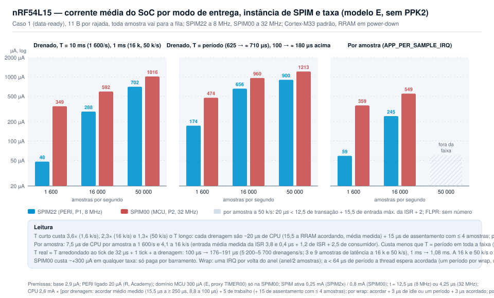

# dppi_works — aquisição SPI sem CPU com DPPI (nRF5340, nRF54L15)

**Em uma frase:** um evento de hardware (o data-ready do sensor ou um TIMER)
dispara a SPIM por DPPI, o EasyDMA grava a rajada em RAM e a CPU só acorda
uma vez a cada N amostras para passá-las a uma fila. Com sensor real,
medido até 1 600 Hz por data-ready com zero perdas; os tetos de barramento,
medidos com disparo por TIMER, são 71,4 k transações/s no nRF5340 (11 B) e
52,6 k/s no nRF54L15 (17 B).

Este caminho é para **taxa alta**. Para centenas de amostras por segundo um
produto usa o subsistema de sensores do Zephyr ou leituras SPI diretas, e o
DPPI não compensa a complexidade; a partir de alguns k amostras/s a CPU no
caminho vira o limite, e é aí que este repositório entra.

Os exemplos usam o DPPI (nRF53/54); o mesmo desenho vale com PPI no nRF52,
não testado. nRF Connect SDK v3.4.1 (nrfx 4.0), chip select por hardware.
Validado na Thingy:53 (nRF5340 + ADXL362) e na nRF54L15 TAG da Nordic
(placa Zephyr `nrf54l15tag`, com BMI270 a bordo), nos cores Cortex-M33 e
FLPR.

Marcação de todo número deste repositório: **M** = medido (log em
`*/test-logs/`), **E** = estimado por modelo, **D** = datasheet, **R** =
relato (Nordic Academy, DevZone), não é especificação.

Índice: [O problema e a ideia](#o-problema-e-a-ideia) ·
[Glossário](#glossário-mínimo) · [Duas decisões](#duas-decisões-e-onde-roda) ·
[Caso 1](#caso-1--data-ready--gpiote--dppi--spim-recomendado) ·
[Caso 2](#caso-2--timer--dppi--spim) · [Anel, contador e wrap](#anel-contador-e-wrap) ·
[Limites](#limites) · [Como escolher](#como-escolher) ·
[Consumo](#consumo--resumo) · [Qual SPIM](#nrf54l15-qual-spim) ·
[ADXL382](#caso-de-alta-taxa-adxl382-a-64-khz-não-testado-em-hardware) ·
[Achados](#achados)

## O problema e a ideia

**TL;DR: com a CPU no caminho, cada amostra custa uma interrupção e um
`spi_transceive`; a 64 k/s isso é a CPU inteira. Com DPPI o caminho
sensor → RAM não tem instrução nenhuma, e a CPU acorda uma vez por bloco.**

Um driver de sensor convencional faz uma transação SPI por chamada: a CPU
acorda, arma o buffer, espera o fim, copia. Isso limita a taxa, gasta
energia e introduz jitter entre a amostra e a leitura. Nos SoCs Nordic os
periféricos têm tarefas e eventos ligáveis pelo DPPI: o evento "amostra
pronta" pode acionar a tarefa `START` da SPIM sem CPU, e o EasyDMA em modo
*array list* escreve N transações seguidas em RAM antes de precisar de uma
interrupção. Este repositório mostra isso funcionando, mede os limites e
explica como escolher a configuração para um sensor concreto.

## Glossário mínimo

| Termo | Significado neste repositório |
|---|---|
| transação | uma rajada SPI: `START` → bytes → `END`. No caso 1 uma transação = uma amostra |
| amostra | um valor do sensor (X, Y, Z); "amostra nova" = data-ready ativo na rajada |
| rajada | os bytes de uma transação: comando + `STATUS` + dados (11 B no ADXL362, 17 B no BMI270) |
| período | intervalo entre dois `START` consecutivos (1/ODR no caso 1, período do timer no caso 2) |
| ODR | taxa de saída do sensor; "nominal" é a configurada, "real" é a medida (tolerância do oscilador do sensor) |
| N | `APP_BLOCK_SAMPLES`: amostras por interrupção (transações por interrupção, iguais no caso 1). IRQ/s = taxa de transações / N. Os dois ajustes de produto são N = 1 (menor latência de entrega) e N = 64 (menor CPU e consumo) |
| slot | espaço de uma rajada no anel |
| anel | buffer de 3N slots: bloco A (slots 0..N−1), bloco B (N..2N−1) e a **folga do anel** (2N..3N−1). RAM = 3N × bytes da rajada |
| array list | modo do EasyDMA em que `RXD.PTR` avança um slot por transação sem CPU (`RX_POSTINC` na nrfx) |
| wrap | a CPU devolver `RXD.PTR` ao slot 0 no fim do bloco B |
| prazo do wrap | tempo que a CPU tem para o wrap: do início da última transação do ciclo até o próximo `START`, ou seja, um período. "Margem" é sempre tempo; "folga" é sempre os N slots |
| `late_wraps` (`late` no log) | wraps feitos depois de o próximo `START` já ter ocorrido: a transação que já tinha começado foi para a folga do anel e não entra na fila (uma amostra perdida, ordem preservada, não se acumula); o contador é a detecção |
| `fresh` | bit de data-ready lido no `STATUS` da própria rajada. Heurístico: com leituras espaçadas menos de ~100 µs o sensor ainda não limpou o bit |
| `queued`, `dropped`, `skipped` | amostras que passaram pela fila no período (postas pela ISR de bloco e lidas pelo consumidor, iguais quando `dropped = 0`); que não couberam na fila; descartadas como repetidas pelo filtro |
| `STARTED` / `DMA.RX.READY` | evento de início de transação contado pelo contador: `STARTED` no nRF5340, `DMA.RX.READY` no nRF54L (a nrfx o chama `RXSTARTED`). É o instante em que o hardware liberou `RXD.PTR` para a próxima escrita |
| contador | TIMER em modo contador ligado por DPPI ao evento acima; seus `COMPARE` geram a interrupção de bloco e a de wrap. `xfers` no log é a leitura dele |
| ISR de bloco (EGU) | a ISR que põe um bloco de N amostras na fila; roda na EGU, periférico que transforma um evento DPPI em interrupção |
| ZLI | zero-latency IRQ do Zephyr (`IRQ_DIRECT_CONNECT` + `CONFIG_ZERO_LATENCY_IRQS`), não bloqueada por `irq_lock()`; usada na ISR de wrap no M33 |
| DPPI, EEP → TEP, GPPI | interconexão de periféricos: um evento (EEP) publica num canal e uma tarefa (TEP) assina o canal. GPPI é a camada da nrfx que aloca canais e, no nRF54L15, as pontes PPIB entre domínios |
| MCU / PERI / LP | domínios de potência do nRF54L15: SPIM00 e TIMER00 em MCU; SPIM2x, TIMER2x, GPIOTE20 e EGU20 em PERI; SPIM30 e GPIOTE30 em LP |
| SPIM2x | SPIM20, 21 e 22: mesmo domínio, clock e custo; 20 e 21 também têm pinos dedicados no P2 |
| PPIB | ponte DPPI entre domínios do nRF54L15; latência entre domínios não especificada no datasheet |
| GRTC | contador de tempo real global do nRF54L15 (LP), o relógio de sistema do Zephyr |
| `CSNDUR` | `IFTIMING.CSNDUR`: tempo entre CSN e SCK e tempo mínimo de CSN inativo, em ciclos do clock do core da SPIM (16 MHz nas SPIM2x/30, 32 MHz na SPIM4 do nRF5340) |
| RRAM standby | no nRF54L15 a RRAM (memória de código) desliga em idle e a primeira instrução de uma ISR espera 13 µs (D, `tIDLE2CPU`); `APP_RRAM_STANDBY` a mantém em standby |
| FLPR / VPR | coprocessador RISC-V do nRF54L15, executa da RAM; VPR é o bloco de hardware que o contém |
| `hfxo_launcher` | imagem do app core que sobe o FLPR e pede o HFXO; substitui o `vpr_launcher` padrão no exemplo TIMER |

Vocabulário fixo: "transação" para o evento SPI, "amostra" para o valor,
"período" para o intervalo, "prazo do wrap" ou "margem" para tempo, "folga
do anel" para os N slots extras e "consumo" para corrente. Taxas em
transações/s; no caso 1 é igual a amostras/s. `xfers` e `STARTs` só
aparecem dentro de blocos de log.

## Duas decisões (e onde roda)

**TL;DR: quem dispara e quantas amostras por interrupção. Toda amostra vai
para a fila; N = 64 é o padrão de consumo, N = 1 o de latência.**

1. **Quem dispara a transação.** O pino de data-ready do sensor (caso 1,
   `gpiote_dppi_spim`, recomendado: uma transação por amostra, sem TIMER de
   disparo, sem HFXO, sem repetidas) ou um TIMER (caso 2, `timer_dppi_spim`:
   polling do sensor em hardware, para sensor sem pino ou taxa fixa; é
   também a bancada).
2. **N, amostras por interrupção.** N = 64: uma ISR a cada 64 amostras, a
   CPU dorme entre blocos, latência de entrega de 64 períodos. N = 1: uma
   ISR por amostra, latência de um período, três a cinco vezes o consumo
   acima de ~5 k/s (E). N = 16 é o intermediário medido.
3. **Onde roda**, quando importa: SoC, instância da SPIM (no nRF54L15
   SPIM2x, ou SPIM00 se o barramento não couber a 8 MHz) e core (Cortex-M33
   ou FLPR). Pesa no prazo do wrap abaixo de 18 µs de período (E, ver
   Limites) e no consumo da SPIM00 (+300 µA, E).

**Consumo em três linhas (nRF54L15, caso 1, SPIM22, E; tabela em
[Consumo](#consumo--resumo)):** N = 64 custa 165 µA a 1 600/s, 352 µA a
16 k/s e 794 µA a 50 k/s; N = 1 custa 236 µA, 1,07 mA e 1,34 mA, metade
disso é a RRAM acordando a cada amostra; N = 1 com RRAM em standby ou no
FLPR cai para 182 µA, 527 µA e 1,34 mA.

## Estrutura do repositório

| Diretório | Conteúdo |
|---|---|
| [`gpiote_dppi_spim/`](gpiote_dppi_spim/README.md) | Caso 1, recomendado: data-ready → GPIOTE IN → DPPI → SPIM. Como compilar, rodar e ler o log. |
| [`timer_dppi_spim/`](timer_dppi_spim/README.md) | Caso 2: TIMER → DPPI → SPIM. É também a bancada: varredura de período, teto do barramento, latência de ISR. |
| [`docs/`](docs) | Diagramas (`gen_diagrams.py` gera os SVG sem dependências) e [`POWER.md`](docs/POWER.md), o modelo de consumo. |
| [`tools/`](tools) | Scripts de gravação e captura de log por RTT. |

Os dois exemplos têm o mesmo engine: `src/spim_dppi.c` existe em cópia
idêntica nos dois diretórios (ao alterar, mude os dois), com os mesmos
backends de sensor e overlays. Cada exemplo traz só o seu disparo.

## Caso 1 — data-ready → GPIOTE → DPPI → SPIM (recomendado)

**TL;DR: uma transação por amostra nova, sem TIMER de disparo e sem HFXO.
Medido até 1 600 Hz (ODR máximo do BMI270) com zero perdas (M).**

O pino INT do sensor vira um evento GPIOTE IN que, por DPPI, aciona
`SPIM.TASKS_START`. O CSN é do hardware e o EasyDMA grava a rajada em RAM.


*Quem liga em quem: o pino do sensor entra no GPIOTE, o DPPI leva o evento
à SPIM; o contador e a EGU geram a interrupção a cada N transações.*


*Uma linha por sinal. Note que o data-ready só desce quando a rajada lê os
registradores de dados: o disparo seguinte depende da leitura anterior.*

**Partida e parada.** O data-ready é um nível, não um pulso: fica alto até
os dados serem lidos. Se o DPPI for ligado com o pino já alto, a borda de
subida nunca acontece. O exemplo dispara um `START` por software logo
depois de ligar o DPPI; a partir daí cada amostra nova gera a borda. Pelo
mesmo motivo, se uma borda se perder (o `START` chega com a SPIM ocupada,
um glitch), a aquisição para de vez com o pino alto: em produto vale um
watchdog que dispara um `START` por software quando o contador não avança
(não implementado nos exemplos).

Resultados no ODR máximo de cada sensor, N = 16 (M):

| Alvo | Sensor | ODR | SCK | Transações/s | queued = fresh | dropped | late_wraps |
|---|---|---|---|---|---|---|---|
| Thingy:53 M33 | ADXL362 | 400 Hz | 4 MHz | ≈ 380 (368–384 entre janelas; ODR real do sensor) | sim | 0 | 0 |
| TAG M33 | BMI270 | 1 600 Hz | 8 MHz | 1 601–1 616 | sim | 0 | 0 |
| TAG FLPR | BMI270 | 1 600 Hz | 8 MHz | 1 601–1 616 | sim | 0 | 0 |

## Caso 2 — TIMER → DPPI → SPIM

**TL;DR: polling do sensor em hardware, para sensor sem pino de data-ready
ou taxa fixa. Timer ≥ 1,05 × ODR e filtro de repetidas; abaixo do ODR real
perde amostras sem aviso (M).**

Um TIMER dispara a SPIM em período fixo. Ler os mesmos registradores em
loop basta, porque eles sempre guardam a última amostra; o bit de data-ready
no `STATUS`, lido na mesma rajada (`fresh`), separa amostras novas de
repetidas. Custo em relação ao caso 1: um TIMER de disparo, o HFXO para
período exato e as repetidas, que precisam ser filtradas
(`APP_QUEUE_FRESH_ONLY`).


*O TIMER ocupa o lugar do GPIOTE; o sensor não participa do disparo.*


*Timer a 100 µs contra sensor a 400 Hz, para mostrar as repetidas: só uma
em cada 25 rajadas traz amostra nova.*

Margem timer × ODR, medida na TAG com o BMI270 a 402/s reais (M,
`timer_dppi_spim/test-logs/u_tag_sweep.log`): timer a 400/s perde cerca de
2 amostras/s **sem deixar rastro**; a 408/s (1,5 % acima do ODR real, 2 %
acima do nominal) não perde nenhuma. Regra de projeto: timer acima do ODR
nominal pela tolerância máxima do oscilador que o datasheet do sensor
declarar, com 5 a 10 % como valor típico.


*Dois relógios livres: abaixo do ODR real a perda é silenciosa; acima, as
repetidas aparecem como `skipped`.*

## Anel, contador e wrap

**TL;DR: anel de 3N slots preenchido pelo EasyDMA; um contador de inícios
de transação gera uma IRQ por bloco de N e a ISR de wrap devolve o
ponteiro ao slot 0 com um período de prazo.**

- **Anel de 3N slots.** Bloco A (slots 0..N−1), bloco B (N..2N−1) e a
  folga do anel (2N..3N−1). O EasyDMA em array list avança um slot por
  transação sozinho; a folga recebe a transação que já começou se o wrap
  atrasar, em vez de corromper memória. RAM: 3N rajadas mais a fila (a
  64 kHz com N = 64 e fila de 512: 2,1 KB + 5,6 KB).
- **Contador de inícios de transação.** Um TIMER em modo contador recebe
  por DPPI o evento `STARTED` (nRF5340) ou `DMA.RX.READY` (nRF54L). Quando a
  transação k começa, o contador vale k+1. Daí os três `COMPARE`:
  - `COMPARE0 = N+1`: começou a transação N, logo o bloco A (0..N−1) está
    completo → DPPI → `EGU.TRIGGER0` → ISR de bloco empurra o bloco A;
  - `COMPARE1 = 2N` (com short `CLEAR`): começou a transação 2N−1, a última
    do ciclo → ISR de wrap escreve `RXD.PTR = slot 0`;
  - `COMPARE2 = 1`: após o `CLEAR`, a primeira transação do ciclo seguinte
    começou, logo o bloco B está completo → `EGU.TRIGGER1` → ISR de bloco
    empurra o bloco B (ignorado no primeiríssimo ciclo).
  - Com N = 1, `COMPARE0` e `COMPARE1` valem 2 e disparam juntos; é o
    bench N = 1, testado.
- **Prazo do wrap = um período.** O datasheet dos dois SoCs diz que
  `RXD.PTR` é double-buffered e pode ser escrito "imediatamente após
  STARTED"; o nRF54L tem o evento explícito `DMA.RX.READY`. Escrever perto
  do `END`, como uma versão anterior fazia, colide com a atualização do
  ponteiro pelo hardware no `START` seguinte (Achado 7 do
  `gpiote_dppi_spim`). Contando inícios, a ISR tem até o próximo `START`.
- **ISR de wrap e ISR de bloco são separadas.** O wrap é a única coisa com
  prazo e roda numa ZLI no M33 (no FLPR uma ISR direta basta). O trabalho da
  fila (N × `k_msgq_put`, filtro de repetidas) roda na ISR de bloco (EGU),
  em prioridade normal. O consumidor faz `k_msgq_get`, uma amostra por vez,
  em ordem.


*N = 4 para caber no desenho: contador, os três `COMPARE`, a ISR de wrap e
a ISR de bloco.*

Contadores do log: `queued` (amostras que passaram pela fila), `fresh` (com
data-ready ativo), `skipped` (repetidas descartadas pelo filtro), `dropped`
(fila cheia), `late_wraps` (wrap depois do `START` seguinte). Teste bom:
`queued = fresh` no caso 1, `dropped = 0`, `late_wraps = 0`.

## Limites

### Teto do barramento

**TL;DR: t = bytes × 8 / SCK + 1,5 µs (E); o teto é 1/t. Medido 52,6 k/s
(17 B) e 71,4 k/s (11 B) a 8 MHz (M).**

| Rajada | SCK | Transação (E, fórmula) | Ocupação a 64 k/s |
|---|---|---|---|
| 11 B | 8 MHz | 12,5 µs | 80 % |
| 11 B | 16 MHz | 7,0 µs | 45 % |
| 11 B | 32 MHz | 4,25 µs | 27 % |
| 17 B | 8 MHz | 18,5 µs | acima de 100 % (teto 52,6 k/s) |

| Alvo | Rajada | SCK | Último período válido | Transações/s | Acima do teto | Fonte |
|---|---|---|---|---|---|---|
| TAG M33 e FLPR, SPIM22 | 17 B | 8 MHz | 19 µs | **52,6 k** | a SPIM para: contando `STARTED` a contagem fica em 0; contando `DMA.RX.READY` continua, com dados congelados (mesmo silício, evento diferente) | M, `u_tag_busmax*.log` |
| Thingy:53 M33, SPIM4 | 11 B | 8 MHz | 14 µs | **71,4 k** | o `START` reinicia a transação em curso; a contagem continua, os dados congelam | M, `u_thingy_bus64k*.log` |


*A 19 µs a transação de 17 B cabe; a 18 µs o `START` chega com a SPIM
ocupada.*

Os 71,4 k/s são da SPIM4 do nRF5340. Para a SPIM2x do nRF54L15 com 11 B a
fórmula dá ~80 k/s (E), não medido: a TAG só tem sensor de 17 B.

### Prazo do wrap × wake-up do core

**TL;DR: o wrap tem um período de prazo. Só vira problema com período menor
que ~18 µs (E) no M33 do nRF54L15 com o core dormindo entre blocos; a saída
é RRAM em standby ou FLPR. O nRF5340 não tem esse problema.**

No nRF54L15 a latência do disparo até a ISR com o core em idle é 16,8 µs
(M) = 13 µs de RRAM em power-down (D, `tIDLE2CPU`) + ~4 µs de DPPI, IRQ e
entrada da ISR (M). Com o core acordado são 1,7–2,6 µs (M). Limiar prático:
período menor que 18 µs. Nos benches com N = 64 o core dorme entre blocos e
o teto de 52,6 k/s (19 µs) passou com `late_wraps = 0` porque 19 µs > 16,8 µs
(M). Com período de 15,6 µs (64 kHz) o wrap atrasaria em cada ciclo: é o
caso que exige `APP_RRAM_STANDBY` (2,75 µs, M) ou o FLPR (2,43 µs
constantes, M). No nRF5340 não há RRAM nem FLPR: a ZLI basta, medido a 14 µs
de período com `late_wraps = 0` e o core dormindo entre blocos (M); a
latência de wake-up do nRF5340 não foi medida.

### nRF54L15: Cortex-M33 × FLPR

**TL;DR: mesmo código nos dois cores. M33 aguenta uma IRQ por amostra até
50 k/s, FLPR até 40 k/s (M); o FLPR tem latência constante sem mexer na
RRAM.**


*Latência do disparo até a ISR de wrap, bench N = 1 na TAG; barras cheias
são a média, claras o máximo.*

| Bench N = 1 (`bench/n1-tag.conf`) | M33 padrão | M33 + RRAM standby | FLPR | Fonte |
|---|---|---|---|---|
| Latência disparo → ISR de wrap, core em idle | 16,8 µs (máx. 17,3) | 2,75 µs (máx. 2,93) | 2,43 µs (máx. 2,50) | M |
| Latência com o core acordado (acima de ~40 k/s) | 1,7–2,6 µs (média 2,3) | 1,7–2,3 µs | 2,43 µs, constante | M |
| Constant latency (`SOC_NRF_FORCE_CONSTLAT`) sozinho | 16,8 µs, não resolve | — | — | M |
| Uma IRQ por amostra sem `late_wraps` até | 50 k/s | 50 k/s | 40 k/s (a 50 k/s todos os wraps atrasam) | M |

| Bench N = 64 (`bench/bus-max-tag.conf`) | M33 | FLPR | Fonte |
|---|---|---|---|
| Teto 17 B a 8 MHz | 52,6 k/s, `late_wraps` 0 | 52,6 k/s, `late_wraps` 0, sem ZLI | M |
| TIMER exato | pede o HFXO no próprio app | precisa do `hfxo_launcher` no app core | M |
| Onde o código roda | RRAM (imagem de 52 KB) | RAM (62 KB dos 96 KB do FLPR) | M |

Quando o FLPR compensa: latência determinística sem tocar a RRAM e liberar
o M33 para a pilha de rádio. Custa o bloco VPR ligado (≈ +0,5 mA, R), 20 %
menos fôlego com uma IRQ por amostra (40 contra 50 k/s, M) e o
`hfxo_launcher` para timers exatos. A 1 600 Hz os dois cores ficam ociosos
e a escolha é de arquitetura.

## Como escolher

**TL;DR: um fluxo de quatro passos com as fórmulas; três exemplos
resolvidos abaixo, cada um com o consumo.**

Entradas: ODR (Hz), B (bytes da rajada, com o comando), SCK máximo do
sensor, latência de entrega aceitável, SoC.

```
1. Disparo
   Sensor tem pino de data-ready?  sim -> gpiote_dppi_spim (caso 1)
                                    não -> timer_dppi_spim, período = 1/(ODR × 1,05..1,10),
                                           APP_QUEUE_FRESH_ONLY=y (caso 2)
2. Cabe no barramento?
   t_trans = B × 8 / SCK + 1,5 µs (E)      (a 8 MHz: B + 1,5 µs)
   t_per   = 1/ODR (caso 1) ou o período do timer (caso 2)
   t_trans / t_per <  0,8 -> ok
                   =  0,8 -> no limite: subir o SCK se possível
                   >  0,8 -> subir o SCK: nRF5340 SPIM4 a 16/32 MHz;
                             nRF54L15 só SPIM00 a 32 MHz (não testado; errata 8 se o
                             primeiro byte do comando tiver o bit mais significativo em 1)
3. N, amostras por interrupção
   Latência de uma amostra é requisito -> N = 1 (uma IRQ por amostra)
   Senão                               -> N = 64 (uma IRQ a cada 64; latência = 64 períodos)
   IRQ/s = taxa de transações / N.  RAM = 3N × B (anel) + profundidade da fila × B.
   Referência: N = 64 a 64 kHz -> 1 000 IRQ/s, 1 ms; N = 64 a 1 600 Hz -> 25 IRQ/s, 40 ms.
4. Prazo do wrap e core
   t_per >= 18 µs -> qualquer core, configuração padrão.
   t_per <  18 µs -> nRF5340: ZLI basta (M, 14 µs).
                     nRF54L15: APP_RRAM_STANDBY=y ou FLPR (M).
   N = 1 acima de ~2 k/s no nRF54L15: APP_RRAM_STANDBY=y ou FLPR, senão metade
   do consumo é a RRAM acordando (E).
   Instância no nRF54L15: SPIM2x (M); SPIM00 só se o passo 2 mandar subir o SCK (E, não testado).
```

Exemplos resolvidos (consumo pela tabela de [Consumo](#consumo--resumo), E):

- **BMI270, 1 600 Hz, 17 B, nRF54L15.** Caso 1. t_trans = 18,5 µs contra
  t_per = 625 µs: 3 %. N = 64 (25 IRQ/s, 40 ms de latência). Período ≫
  18 µs: M33 padrão. SPIM22. Medido com N = 16: 1 601 a 1 616/s, zero
  perdas (M). Consumo: linha "N = 64, SPIM22" a 1 600/s, 165 µA, mais
  0,25 mA × 1 600 × 6 µs = 2 µA pelos 17 B: ≈ 167 µA (E), dos quais 121 são o
  contador.
- **ADXL382, 64 kHz, 11 B, latência de 1 ms, nRF54L15.** Caso 1. 80 % na
  SPIM2x a 8 MHz (atende, sem margem); SPIM00 a 32 MHz, 27 % (margem, não
  testado). N = 64 (1 000 IRQ/s). Período de 15,6 µs < 18 µs: RRAM em
  standby ou FLPR. Consumo: ≈ 0,97 mA na SPIM22, ≈ 1,28 mA na SPIM00 (E,
  `docs/POWER.md`, seção ADXL382). Não testado em hardware.
- **ADXL382, 64 kHz, 11 B, nRF5340.** Caso 1. t_trans = 12,5 µs contra
  15,6 µs: 80 %, no limite; SPIM4 a 16 MHz dá 45 %. N = 64. Período < 18 µs:
  ZLI basta (M, 14 µs com o ADXL362). Consumo: ≈ 2,2 mA a 16 MHz, ≈ 2,7 mA
  a 8 MHz, só o SoC (E, tabela do nRF5340 em `docs/POWER.md`). Não testado
  em hardware.

## Consumo — resumo

**TL;DR: modelo, sem PPK2. N = 1 contra N = 64 é a alavanca acima de
~5 k/s, e metade do custo de N = 1 é a RRAM acordando; a SPIM00 soma
~300 µA constantes; o contador de 121 µA faz parte do desenho. Modelo
completo e premissas em [`docs/POWER.md`](docs/POWER.md).**



*Corrente média do SoC contra amostras/s para N = 64 e N = 1, SPIM22 e
SPIM00 do nRF54L15 (E). A barra tracejada é N = 1 com RRAM em standby ou
no FLPR.*

Caso 1 (data-ready), rajada de 11 bytes, toda amostra na fila, Cortex-M33
padrão (RRAM em power-down). SPIM22 a 8 MHz (12,5 µs por transação), SPIM00
a 32 MHz (4,25 µs). Corrente média do SoC em µA (E). Premissas: base 2,9;
domínio PERI mantido pelo GPIOTE 20 (R); domínio MCU 300 (E) só na SPIM00;
SPIM ativa 0,25 mA (2x) ou 0,8 mA (00); contador 121; CPU 2,6 mA × 3,8 µs
(N = 64), 4,8 µs (N = 16) ou 21 µs (N = 1: 8 de trabalho + 13 de wake-up da
RRAM) por amostra.

| N | Instância (SCK) | 1 600/s | 16 k/s | 50 k/s |
|---|---|---|---|---|
| N = 64 | SPIM22 (8 MHz) | **165** | **352** | **794** |
| N = 64 | SPIM00 (32 MHz) | 465 | 656 | 1 108 |
| N = 16 | SPIM22 | 169 | 394 | 924 |
| N = 16 | SPIM00 | 469 | 698 | 1 238 |
| N = 1, M33 padrão | SPIM22 | 236 | 1 068 | 1 340 |
| N = 1, M33 padrão | SPIM00 | 536 | 1 372 | 1 654 |
| N = 1, RRAM em standby ou FLPR | SPIM22 | 182 | 527 | 1 340 |

Notas da tabela: rajada de 17 bytes: somar 0,25 mA × taxa × 6 µs. O modelo
de N = 1 não é monotônico: o bench mostra o core deixando de dormir entre
25 e 40 k/s, e a partir daí sobram só os 8 µs de trabalho; a coluna de
50 k/s já usa 8 µs. No FLPR somar ≈ 0,5 mA do bloco VPR (R). PERI 20 µA (R)
é a premissa de menor confiança, mas desloca todas as linhas por igual.

Três leituras:

1. **N = 1 contra N = 64 é a alavanca acima de ~5 k/s.** A 16 k/s são
   1,07 mA contra 0,35 mA; a 50 k/s, 1,34 contra 0,79. Cerca de metade do
   custo de N = 1 até ~40 k/s é a RRAM acordando a cada amostra (13 dos
   21 µs de CPU por amostra, ≈ 50 % do total a 16 k/s); com RRAM em standby
   ou no FLPR N = 1 cai para 0,53 mA a 16 k/s. O custo de idle da RRAM em
   standby não é publicado.
2. **A SPIM00 custa ~300 µA a mais em qualquer taxa** (o domínio MCU
   ligado, E). Só paga pela margem de barramento: SCK acima de 8 MHz,
   rajada longa a 64 k/s, ou taxa acima de ~80 k/s (E). Nunca por consumo.
3. **O contador TIMER (121 µA) faz parte do desenho** e não é alavanca
   nestas taxas: a 16 k/s são 34 % do N = 64 e 11 % do N = 1; a 50 k/s,
   15 % e 9 %.

Regra que sai da tabela: data-ready + N = 64 na SPIM22, salvo se a latência
de uma amostra for requisito (então N = 1 com RRAM em standby ou FLPR) ou o
barramento não couber a 8 MHz (então SPIM00).

nRF5340 (SPIM4, caso 1, 11 B, E, sem HFXO): a 1 600/s N = 64 ≈ 0,58 mA,
porque o contador custa 475 µA; a 64 k/s N = 64 ≈ 2,7 mA a 8 MHz ou 2,2 mA
a 16 MHz, N = 1 ≈ 3,6 ou 3,1 mA. Tabela em `docs/POWER.md`.

## nRF54L15: qual SPIM

**TL;DR: SPIM2x no caso geral (testada). SPIM00 só se o barramento não
couber a 8 MHz, em teoria: a TAG não a alcança.**

Fatos de hardware (D):

| Instância | Domínio | Clock do core | SCK máx. | Pinos | DPPI |
|---|---|---|---|---|---|
| SPIM00 | MCU | 128 MHz | 32 MHz (`PRESCALER` 4..126) | P2, dedicados, drive E0/E1 para 32 MHz | DPPIC00, 8 canais |
| SPIM20/21/22 | PERI | 16 MHz | 8 MHz (`PRESCALER` 2..126) | P1 (20/21 também P2) | DPPIC20, 16 canais |
| SPIM30 | LP | 16 MHz | 8 MHz | P0 | DPPIC30, 4 canais |

Consequências:

- **SPIM2x (M).** Mesmo domínio do GPIOTE20, dos TIMER2x e da EGU20: caminho
  inteiro sem PPIB. É o que os exemplos usam. As três instâncias têm o
  mesmo clock e o mesmo custo.
- **SPIM00 (E, não testado).** 4× o barramento: 17 B em 4,25 µs. O disparo
  vem de PERI pelo PPIB01/PPIB21 (latência não especificada; wake-up se o
  domínio dormir). A errata 8 vale para todo o prescaler dela (mínimo 4),
  mas só atinge comandos cujo primeiro byte tem o bit mais significativo em
  1: com CPHA = 0 e esse bit em 1 o workaround da nrfx exige uma escrita por
  transação, incompatível com disparo por DPPI. O `0x83` do BMI270 é
  afetado; o `0x0B` do ADXL362 e o `0x23` do ADXL382 não. Faz sentido para
  rajada longa a 64 k/s, taxa acima do que 8 MHz alcança, sensor que exige
  SCK > 8 MHz, ou domínio MCU já ligado por outro motivo. Nunca por consumo.
- **SPIM30 (LP, P0).** Só compensa quando o domínio PERI pode dormir entre
  transações, o que não acontece neste uso: o contador e a EGU ficam em
  PERI e acordam o domínio a cada transação pelo PPIB.

**O que a TAG permite.** Só a SPIM22: o BMI270 está em P1.05/06/08, CSN
P1.07, INT P1.04, e os pontos de teste expostos (P0.01, P0.02, P0.04,
P1.02, P1.03, P1.13, P1.14, P2.05, P2.06, P2.07) não formam os quatro pinos
de SPIM00 (SCK P2.01/06, SDO P2.02/08, SDI P2.04/09, CSN P2.05/10) nem de
SPIM30 (quatro pinos no P0). O teste fica para o nRF54L15 DK: SPIM00 nos
pinos P2.06/08/09/10, conectados por padrão; SPIM30 em P0.00–P0.03,
desconectando a UART0 do depurador no Board Configurator, com P0.04 como
INT. No código muda só o overlay (`chosen app,accel` sob `spi00` ou
`spi30`, `pinctrl`, `cs-gpios`); a GPPI da nrfx 4.0 resolve o PPIB sozinha.

Consumo por instância: tabela em [Consumo](#consumo--resumo); quando a
SPIM00 faz sentido, em [`docs/POWER.md`](docs/POWER.md#quando-a-spim00-faz-sentido).

## Caso de alta taxa: ADXL382 a 64 kHz (não testado em hardware)

**TL;DR: o caminho do caso 1 serve sem mudar a arquitetura; o que muda é o
backend do sensor, o SCK e, no nRF54L15, a RRAM ou o FLPR. Tudo aqui é E.**

O ADXL382 gera data-ready a 16, 32 ou 64 kHz.


*Timing esperado a 64 kHz: a 8 MHz a rajada de 11 B ocupa 80 % do período,
a 16 MHz 45 %, a 32 MHz 27 %. O prazo do wrap é o período, 15,6 µs, qualquer
que seja o SCK.*

Ocupação e prazo:

| Instância | SCK | Transação (E) | Ocupação | Prazo do wrap | Observação |
|---|---|---|---|---|---|
| nRF5340 SPIM4 | 8 MHz | 12,5 µs | 80 % | 15,6 µs | mesmo perfil medido a 71,4 k/s com o ADXL362 (M); sem margem para jitter ou `CSNDUR` maior |
| nRF5340 SPIM4 | 16 MHz | 7,0 µs | 45 % | 15,6 µs | recomendado |
| nRF54L15 SPIM2x | 8 MHz | 12,5 µs | 80 % | 15,6 µs | atende, sem margem; não testado com 11 B |
| nRF54L15 SPIM00 | 32 MHz | 4,25 µs | 27 % | 15,6 µs | margem; não testado. Errata 8 não se aplica ao ADXL382 (primeiro byte `0x23`, MSB 0) |

O que trocar no `gpiote_dppi_spim`:

1. **Backend `src/sensor_adxl382.c`** (item novo na `choice APP_SENSOR`,
   `target_sources_ifdef` no CMake). Diferenças para o ADXL362: o primeiro
   byte é `(endereço << 1) | 1` para leitura, com auto-incremento, sem o
   comando `0x0B`; rajada `burst_tx = { (0x11 << 1) | 1 }` = `0x23`, 11 bytes
   (`STATUS0..ZDATA_L`, 0x11..0x1A); `fresh_offset = 1`, `fresh_mask = 0x01`
   (`STATUS0.DATA_READY`); dados big-endian em `rx[5..10]`; `mg_per_lsb`
   pela faixa (±15 g: 2000 LSB/g); `init()` lê `DEVID_AD` (0x00 = 0xAD) e
   põe o modo de alto desempenho com ODR 64 kHz em `OP_MODE` (0x26; código
   do ODR a confirmar no datasheet, que não está no repositório);
   `enable_drdy_int()` mapeia `DATA_READY` no INT0.
2. **Overlay**: nó `adxl382@0` sob `spi4` (nRF5340) com `int1-gpios` e
   `spi-max-frequency = <16000000>`. Não há binding `adi,adxl382` no NCS
   3.4.1: acrescentar `dts/bindings/adi,adxl382.yaml` no app.
3. **`APP_SPI_FREQ_HZ = 16000000`** na SPIM4 do nRF5340; no nRF54L15 a
   SPIM2x atende a 8 MHz (80 %, sem margem) e só a SPIM00 passa de 8 MHz.
4. **N e fila**: `APP_BLOCK_SAMPLES = 64` (1 000 IRQ/s), `APP_QUEUE_DEPTH
   ≥ 512` (a fila precisa de dois blocos mais o atraso do consumidor; 512 ×
   11 B = 5,6 KB). O prazo do wrap é um período, 15,6 µs, menor que os
   16,8 µs de wake-up do M33 do nRF54L15: lá, `APP_RRAM_STANDBY=y` ou FLPR.
   No nRF5340 basta `CONFIG_ZERO_LATENCY_IRQS=y`, medido a 14 µs (M).
   `late_wraps` no log confirma.
5. **Verificação**: transações/s no log = 64 000 ± tolerância do oscilador
   do sensor, `fresh = queued`, `late_wraps = 0`, Z variando (dados válidos).

Consumo estimado a 64 k amostras/s, só o SoC (E, [`docs/POWER.md`](docs/POWER.md)):

| SoC / instância | N = 64 | N = 1 (core acordado) |
|---|---|---|
| nRF5340 SPIM4, 8 MHz | ≈ 2,7 mA | ≈ 3,7 mA |
| nRF5340 SPIM4, 16 MHz | ≈ 2,2 mA | ≈ 3,2 mA |
| nRF54L15 SPIM22, 8 MHz | ≈ 0,97 mA | ≈ 1,7 mA |
| nRF54L15 SPIM00, 32 MHz | ≈ 1,28 mA | ≈ 2,0 mA |

No nRF5340 dominam a SPIM (1,7 mA enquanto transfere, D) e o contador
(475 µA, D); no nRF54L15 a CPU (≈ 630 µA com N = 64) e o barramento. O
consumo do ADXL382 não está incluído.

## Achados

Os achados de silício e de bancada estão nos READMEs dos exemplos:
[`gpiote_dppi_spim`](gpiote_dppi_spim/README.md#achados) (data-ready em
nível, errata 8 da SPIM no nRF54L15, `RXDELAY` em ciclos de 16 MHz,
tempestade de IRQ da SPIM, GPIOTE compartilhado, escrita do `RXD.PTR`) e
[`timer_dppi_spim`](timer_dppi_spim/README.md#achados) (HFXO no FLPR,
wake-up da RRAM, `fresh` acima do ODR, log deferred, sysbuild).
