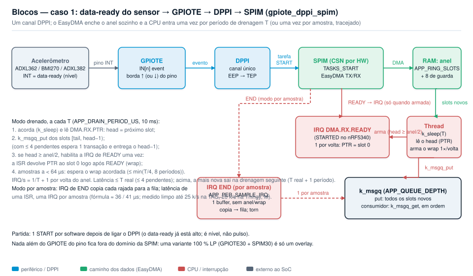
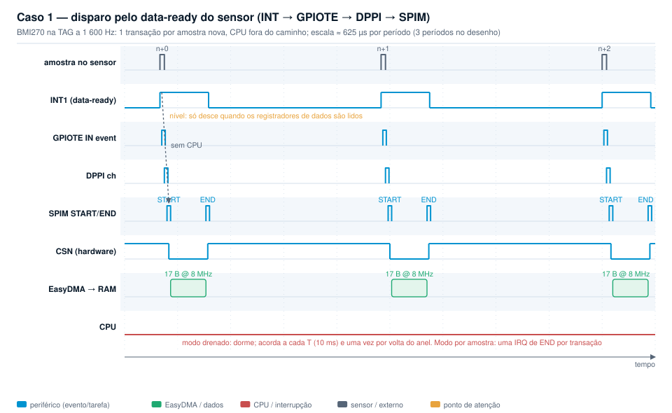
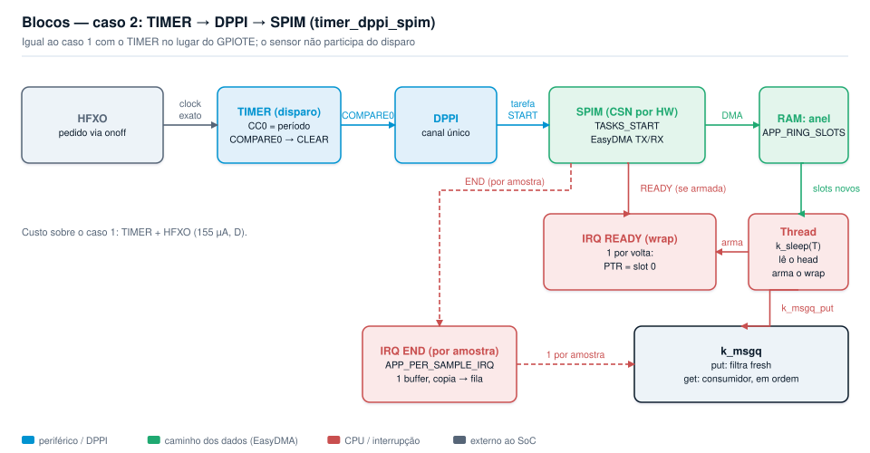
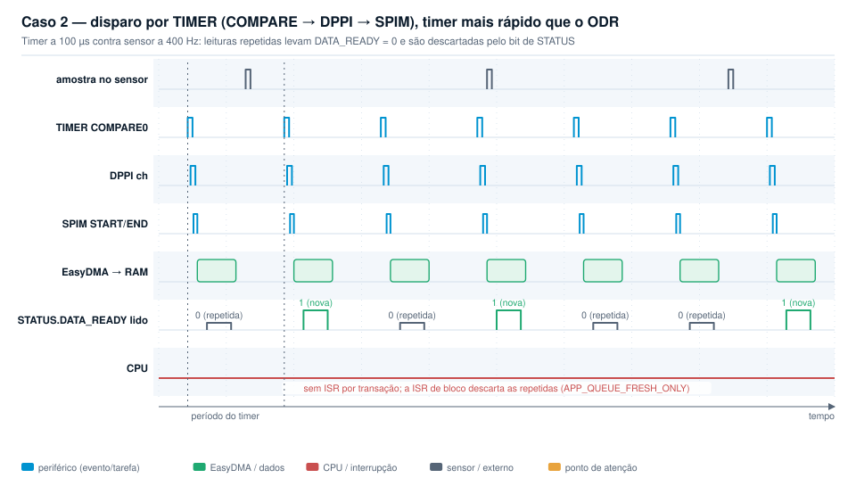
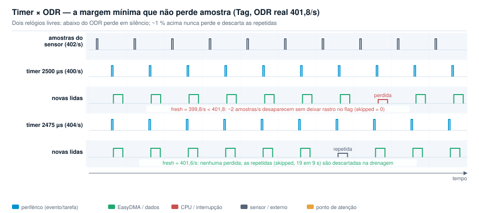
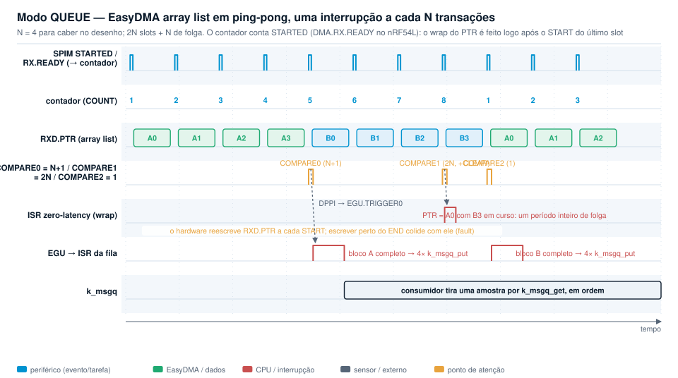
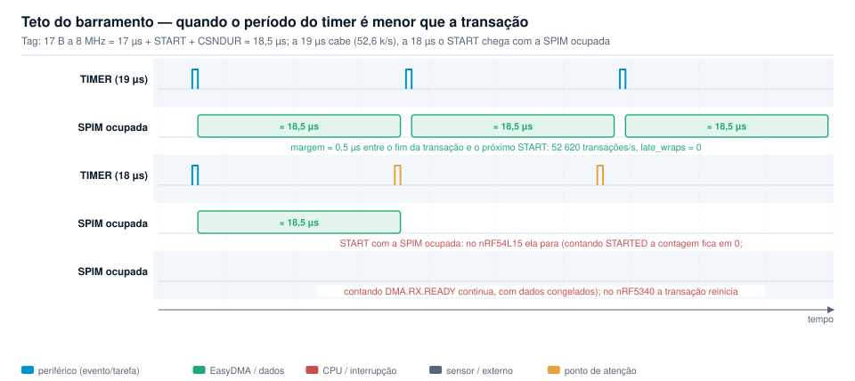
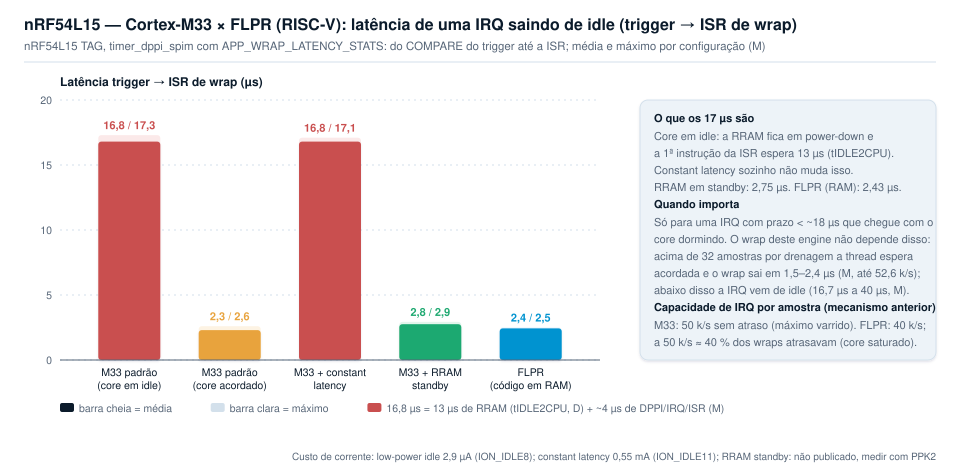
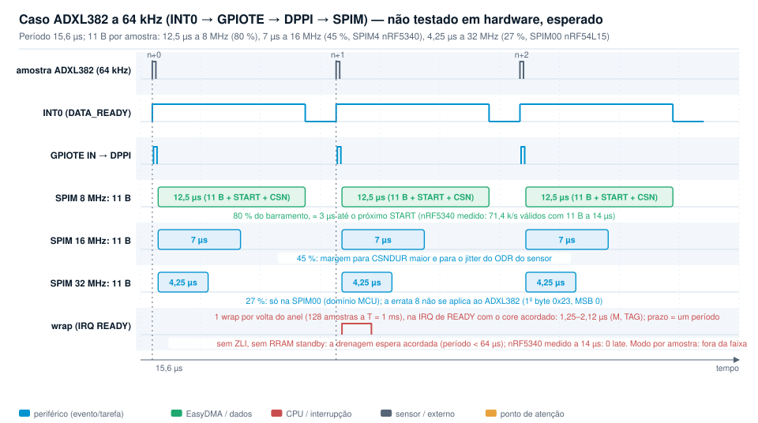

# dppi_works — aquisição SPI sem CPU com xPPI (DPPI/PPI) no nRF5340 e nRF54L15

Exemplos de interligação de periféricos por xPPI: um evento de hardware
dispara a SPIM, o EasyDMA entrega a rajada em RAM e a CPU só entra para
consumir os dados. O caso concreto é um acelerômetro SPI lido no seu
data-ready ou em taxa fixa por TIMER. Os exemplos rodam em nRF Connect SDK
v3.4.1 (nrfx 4.0), com chip select por hardware, e foram validados na
Thingy:53 (nRF5340 + ADXL362) e na nRF54L15 TAG (BMI270), nos cores Cortex-M33
e FLPR.

| Diretório | Conteúdo |
|---|---|
| [`gpiote_dppi_spim/`](gpiote_dppi_spim/README.md) | **Exemplo recomendado.** O pino de data-ready do sensor dispara a SPIM (INT → GPIOTE → DPPI → SPIM). Uma transação por amostra, sem timer, sem HFXO, sem leituras repetidas. |
| [`timer_dppi_spim/`](timer_dppi_spim/README.md) | Exemplo opcional. Um TIMER dispara a SPIM em taxa fixa. Inclui a bancada: varredura de período, teto do barramento e margem timer × ODR. |
| [`docs/`](docs) | Diagramas de blocos e de timing (`gen_diagrams.py` gera os SVG, sem dependências) e [análise de consumo](docs/POWER.md). |
| [`tools/`](tools) | Scripts de gravação e captura de log por RTT usados nos testes. |
| `adxl382_spim/`, `17_adxl362_dt/`, `gpiote_dppi_gpiote/`, `timer_gppi_gpiote/` | Experimentos anteriores (NCS v2.7.0, tag `ncs-v2.7.0`). |

Os dois exemplos compartilham o mesmo engine (`src/spim_dppi.c`), os mesmos
backends de sensor e os mesmos overlays. Cada um traz só o seu disparo. O
consumo das amostras é escolhido por Kconfig nos dois:

- **Modo LATEST**: o EasyDMA reescreve sempre o mesmo buffer. A CPU lê o
  último valor quando quiser, sem interrupções.
- **Modo QUEUE**: o EasyDMA em *array list* enche um anel em ping-pong. A
  cada N transações uma interrupção empurra o bloco para uma `k_msgq`.

## Os dois casos

Cada caso tem um diagrama de **blocos** (quem liga em quem, por DPPI) e um de
**timing** (uma linha por sinal, tempo na horizontal).

### Caso 1: disparo pelo data-ready do sensor (recomendado)

O pino INT do sensor vira um evento GPIOTE que, por DPPI, aciona o
`TASKS_START` da SPIM. O CSN é do hardware e o EasyDMA entrega a rajada em
RAM. Uma transação por amostra nova, nenhuma instrução de CPU no caminho.

O data-ready é um **nível**: fica alto até os registradores de dados serem
lidos. Sem uma primeira leitura depois de ligar a medição, a borda de subida
nunca acontece. O exemplo dispara um `START` por software logo após ligar o
DPPI; daí em diante cada amostra nova gera a borda.

Resultado no ODR máximo de cada sensor, modo QUEUE com N = 16, zero perdas:

| Alvo | ODR máximo do sensor | Medido |
|---|---|---|
| Thingy:53 M33, ADXL362 | 400 Hz | 384/s (ODR real do sensor −5 %), queued = fresh |
| Tag M33, BMI270 | 1600 Hz | 1601–1616/s, queued = fresh, 0 perdas |
| Tag FLPR, BMI270 | 1600 Hz | 1601–1616/s, 0 perdas |

### Caso 2: disparo por TIMER (opcional)

Um TIMER dispara a SPIM em período fixo, independente do sensor. Ler os
mesmos registradores em loop basta, porque eles sempre guardam a última
amostra. O bit de data-ready no `STATUS`, lido na mesma rajada, marca as
amostras novas e permite descartar as repetidas.

Medido na Tag (ODR real 402/s): um timer a 400/s perde cerca de 2 amostras
por segundo **sem deixar rastro**. A partir de 2 % acima do ODR (408/s) não
perde nenhuma.

## Consumo das amostras: modo LATEST ou modo QUEUE

No modo LATEST o EasyDMA reescreve sempre o mesmo buffer e a CPU lê uma cópia
coerente quando precisa. No modo QUEUE o EasyDMA em *array list* enche um
anel em ping-pong de 2N amostras, com mais N de folga. Um TIMER em modo
contador conta, por transação, o evento que libera os registradores de
ponteiro: `DMA.RX.READY` no nRF54L, `STARTED` no nRF5340. No início da última transação do ciclo
uma ISR zero-latency reposiciona o ponteiro (wrap) com a transação inteira
de margem, que é a janela segura do datasheet para escrever o `RXD.PTR`; a
cada bloco completo a EGU, acionada por DPPI, roda a ISR que alimenta a
fila (`k_msgq`).

## Teto do barramento

A 8 MHz, uma rajada de 17 bytes (BMI270) ocupa 17 µs mais 1 µs de `START` e
o tempo de CSN, cerca de 18,5 µs. Cabem 52,6 k transações por segundo
(19 µs). Com período de 18 µs o `START` chega com a SPIM ocupada e, no
nRF54L15, ela para. Com rajada de 11 bytes (ADXL362) o nRF5340 chegou a
71,4 k/s (14 µs); abaixo disso o `START` reinicia a transação em curso e os
dados deixam de ser válidos, embora os `STARTED` continuem a ser contados.
O wrap do anel do modo QUEUE não limita: tem a transação inteira de margem.

| Alvo | TIMER 1 kHz | TIMER 10 kHz + QUEUE | Teto (QUEUE, filtro na ISR) |
|---|---|---|---|
| Thingy:53 M33 (ADXL362, 11 B) | 1000/s exato | 10000/s, fresh ≈ 380 | **71,4 k/s** (14 µs), `late_wraps` 0 de 25 a 14 µs |
| Tag M33 (BMI270, 17 B) | 1000/s exato | 10000/s, fresh 402 | **52,6 k/s** (19 µs), `late_wraps` 0; a 18 µs a SPIM para |
| Tag FLPR (BMI270) | 10001/s (HFXO pedido pelo app core) | — | **52,6 k/s** (19 µs), `late_wraps` 0 sem ZLI |

## nRF54L15: Cortex-M33 × FLPR (RISC-V)

Os dois cores rodam o mesmo código (`nrf54l15tag/nrf54l15/cpuapp` e
`cpuflpr`). O bench `bench/n1-tag.conf` do `timer_dppi_spim` mede a latência
do disparo até a ISR de wrap e o teto com uma interrupção por amostra (N = 1).

| | Cortex-M33 (padrão) | Cortex-M33 + RRAM standby | FLPR (RISC-V) |
|---|---|---|---|
| Latência trigger → ISR de wrap, core em idle | 16,8–17,3 µs | 2,75 µs (máx. 2,93) | 2,43 µs (máx. 2,50) |
| Latência com o core acordado (≥ 40 k/s) | 1,7–2,6 µs | idem | idem |
| Zero-latency IRQ | sim (`IRQ_DIRECT_CONNECT`) | sim | não existe; ISR direta basta |
| N = 1 (wrap + EGU + `k_msgq_put` por amostra) sem atraso | 50 k/s | 50 k/s | 40 k/s; a 50 k/s todos os wraps atrasam |
| Teto do barramento (17 B a 8 MHz, N = 64) | 52,6 k/s, `late_wraps` 0 | idem | 52,6 k/s, `late_wraps` 0 |
| TIMER exato | pede o HFXO | idem | precisa do `hfxo_launcher` no app core |
| Código | RRAM (52 KB) | RRAM | RAM (62 KB dos 96 KB do FLPR) |
| Corrente extra em idle | 2,9 µA (ION_IDLE8) | RRAM standby: não publicado | bloco VPR ligado: ≈ +0,5 mA (DevZone) |

**Os 17 µs do M33 são a RRAM, não o core.** Com o core em idle a RRAM
entra em power-down (`RRAMC.POWER.LOWPOWERCONFIG.MODE = PowerDown`, o
padrão) e a primeira instrução da ISR espera o wake-up: o datasheet dá
`tIDLE2CPU` = 13 µs (9 µs em constant latency). Constant latency sozinho
(`CONFIG_SOC_NRF_FORCE_CONSTLAT`) não mudou a medição; a RRAM em standby
(`nrf_rramc_lp_mode_set(NRF_RRAMC, NRF_RRAMC_LP_STANDBY)`, Kconfig
`APP_RRAM_STANDBY` no exemplo) deixa o M33 em 2,75 µs constantes. O FLPR
executa da RAM e não tem o problema. `DMA.RX.READY` e `STARTED` dão a mesma
latência (±0,4 µs).

**Isso perde dados?** Não nas taxas medidas. A aquisição em si não passa
pela CPU; o único prazo de ISR é o wrap do anel no modo QUEUE, e ele tem a
transação inteira mais o intervalo até o próximo `START` de margem. Com
17 µs de latência o wrap só atrasaria com período menor que ~18 µs, ou
seja, acima de ~55 k transações/s com o core dormindo entre elas. Nessa
faixa o core já não dorme (a partir de ~40 k/s a latência cai para 2 µs) e
o barramento da TAG para em 52,6 k/s. Zero `late_wraps` em todos os
passos. O caso que precisa da RRAM em standby ou do FLPR: rajadas curtas em
SPIM00 a 32 MHz com período abaixo de 18 µs (ADXL382 a 64 kHz é 15,6 µs) e
N grande, porque aí o core dorme entre blocos. No modo LATEST não há prazo
nenhum. Um wrap atrasado desloca as amostras um slot dentro do anel, não
corrompe memória.

**Quando o FLPR compensa.** Latência determinística sem mexer na RRAM, e
liberar o M33 para a pilha de rádio. Custa o bloco VPR ligado, ~10 k IRQ/s a
menos de fôlego que o M33 e o `hfxo_launcher` para timers exatos. Para
sensores a 400 ou 1600 Hz, os dois cores ficam ociosos e a escolha é de
arquitetura, não de desempenho.

### Qual SPIM do nRF54L15 usar

| Instância | Domínio | Clock do core | SCK máx. | Pinos | DPPI | Observações |
|---|---|---|---|---|---|---|
| SPIM00 | MCU | 128 MHz | 32 MHz (`PRESCALER` 4..126) | P2 (pads de alta velocidade) | DPPIC00, 8 canais | 4× o barramento das SPIM2x: 17 B em 4,25 µs. O disparo (GPIOTE20/TIMER2x, PERI) cruza o PPIB01/PPIB21: latência extra e wake-up se um domínio estiver dormindo. **Errata 8 aplica-se sempre** (`PRESCALER` ≥ 4): com CPHA = 0 e primeiro bit 1 o workaround da nrfx precisa de uma escrita por transação, incompatível com disparo por DPPI; usar CPHA = 1 ou comando com primeiro bit 0. |
| SPIM20/21/22 | PERI | 16 MHz | 8 MHz (`PRESCALER` 2..126) | P1 (20/21 também P2) | DPPIC20, 16 canais | Mesmo domínio do GPIOTE20 e dos TIMER2x: caminho inteiro sem PPIB. É o que os exemplos usam. |
| SPIM30 | LP | 16 MHz | 8 MHz | P0 | DPPIC30, 4 canais | Mesmo domínio do GPIOTE30 (P0, 4 canais). Sem TIMER no domínio LP: o contador fica em PERI via PPIB22/PPIB30. |

**O que dá para testar na TAG.** Só a SPIM22. O BMI270 está ligado à
SPIM22 pelos pinos P1.05/06/08, CSN P1.07 e INT P1.04, e os únicos pinos
expostos em pontos de teste são P0.01, P0.02, P0.04, P1.02, P1.03, P1.13,
P1.14, P2.05, P2.06 e P2.07 (documentação da TAG, confirmada no MCP). A
SPIM00 usa pinos dedicados do P2: SCK P2.01 ou P2.06, SDO P2.02 ou P2.08,
SDI P2.04 ou P2.09, CSN P2.05 ou P2.10; dos expostos só há SCK e CSN, sem
SDO/SDI. A SPIM30 precisa de quatro pinos no P0 e há três expostos. Logo
nem com fios se liga um sensor à SPIM00 ou à SPIM30 na TAG. Os resultados
para essas duas instâncias abaixo são teóricos; o teste em hardware fica
para o nRF54L15 DK com um sensor ligado por fio.

**Como seria no nRF54L15 DK.** O SoC é QFN48 (P0.00 a P0.04, P1.00 a
P1.14, P2.00 a P2.10) e os três ports estão em headers. SPIM00: os pinos
P2.06/08/09/10 (conjunto alternativo, compartilhado com o trace) vêm
conectados por padrão; P2.01/02/04/05 vão para a flash externa e exigem o
Board Configurator. Para 32 MHz os pinos precisam de drive E0/E1 no
`PIN_CNF` (datasheet, "Dedicated pins"). SPIM30: P0.00 a P0.03 são a UART0
do depurador, a desconectar no Board Configurator, e P0.04 é o botão 3, que
serve de INT com GPIOTE30. Nada muda no código além do overlay: `chosen
app,accel` num nó sob `spi00` ou `spi30`, `pinctrl` com os pinos acima e
`cs-gpios` no port certo; a GPPI da nrfx 4.0 resolve as ligações entre
domínios pelo PPIB sozinha (`helpers/nrfx_gppi_routes.h`).

**Estimativa a 64 k amostras/s (rajada de 11 bytes, período 15,6 µs).**

| Instância | SCK | Transação | Ocupação | Folga para o wrap | Canais DPPI | Observações |
|---|---|---|---|---|---|---|
| SPIM22 (PERI) | 8 MHz | ≈ 12,3 µs | 80 % | 15,6 µs (um período) | 4 de 16 no DPPIC20 | Medido no nRF5340 com o mesmo perfil: 71,4 k/s válidos. Sem PPIB. |
| SPIM00 (MCU) | 32 MHz | ≈ 3,4 µs (2,75 + START) | 22 % | 15,6 µs | 2 no DPPIC00 (START, RX.READY) + PPIB01/21 + 2 no DPPIC20 | Errata 8 sempre ativa: CPHA = 1 ou primeiro bit 0. O domínio MCU fica acordado pela SPIM; o disparo em PERI cruza o PPIB (latência extra, não especificada). Única que aceita rajadas maiores ou `CSNDUR` maior a 64 k. |
| SPIM30 (LP) | 8 MHz | ≈ 12,3 µs | 80 % | 15,6 µs | 2 de 4 no DPPIC30 + PPIB30/22 + 2 no DPPIC20 | Sensor no P0 com GPIOTE30 (4 canais). O contador e a EGU ficam em PERI, então PERI acorda a cada transação; só o modo LATEST sem contador deixa PERI dormir. |

As três atendem 64 k/s com 11 bytes; SPIM22 e SPIM30 sem margem, SPIM00
com 4×. A folga do wrap é um período nos três casos (após o `RX.READY` o
ponteiro pode ser escrito até o próximo `START`), então a 15,6 µs o M33
precisa da RRAM em standby ou do FLPR em modo QUEUE, qualquer que seja a
SPIM. O uso de CPU por amostra é igual nas três. A 400 ou 1600 Hz as três
funcionam igual; a diferença é consumo (LP × PERI × MCU acordados) e não
desempenho. Estimativa de consumo das três a 64 k/s em
[docs/POWER.md](docs/POWER.md#nrf54l15-spim00--spim22--spim30-a-64-k-amostrass).

**Desempenho.** Só a SPIM00 muda o teto: com 8 MHz o limite é 52,6 k/s
para 17 B e ~80 k/s para 11 B; a 32 MHz caberiam 4× mais transações por
segundo, ou a mesma taxa com 4× mais folga para o wrap. Para 64 kHz com
rajada de 11 B é a diferença entre 80 % e 20 % de ocupação do barramento.
O preço é atravessar o PPIB (o DPPI do domínio MCU corre a 128 MHz, o de
PERI a 16 MHz; a latência entre domínios não é especificada em ciclos) e a
errata 8.

**Consumo.** O datasheet do nRF54L15 não publica a corrente das SPIM nem
dos domínios. O que se sabe: um GPIOTE IN em evento mantém o domínio do
pino ligado em System ON idle (Academy: +17 µA medidos com PERI ligado na
DK, 20 µA contra 3 µA); o domínio LP existe para ficar ligado com PERI
desligado. Logo, para o caso 1 com poucas amostras por segundo, sensor no
P0 com GPIOTE30 → DPPIC30 → SPIM30 é o caminho de menor consumo: PERI e
MCU dormem entre transações, e no modo LATEST nem o contador é necessário.
O modo QUEUE precisa do TIMER contador em PERI, o que reacende o domínio
a cada transação. Os números exatos são para medir com PPK2; a estimativa
em [docs/POWER.md](docs/POWER.md) usa os limites que o datasheet dá.

## Caso de alta taxa: ADXL382 a 64 kHz

O ADXL382 gera data-ready a até 64 kHz (16, 32 ou 64 kHz selecionáveis). O
caminho do caso 1 serve sem mudança de arquitetura. O que muda é o backend
do sensor e a folga do barramento.

### O que trocar no `gpiote_dppi_spim`

1. **Backend `src/sensor_adxl382.c`** (novo item na `choice APP_SENSOR`,
   `target_sources_ifdef` no CMake). Diferenças para o ADXL362:
   - protocolo SPI: o primeiro byte é `(endereço << 1) | 1` para leitura,
     com auto-incremento; não existe o comando `0x0B`. Rajada:
     `burst_tx = { (0x11 << 1) | 1 }`, `burst_tx_len = 1`,
     `SENSOR_BURST_LEN = 11` (1 comando + `STATUS0..ZDATA_L`, 0x11..0x1A);
   - `fresh_offset = 1`, `fresh_mask = 0x01` (`STATUS0.DATA_READY`);
   - dados **big-endian** em `rx[5..10]` (`XDATA_H, XDATA_L, …`), ao
     contrário do ADXL362; `decode()` faz `(rx[5] << 8) | rx[6]` etc.;
   - `mg_per_lsb` pela faixa (±15 g: 2000 LSB/g → 0,5 mg/LSB);
   - `init()`: `DEVID_AD` (0x00) = 0xAD; standby → modo de alto desempenho
     com ODR 64 kHz no registrador `OP_MODE` (0x26; o código do ODR e a
     necessidade de faixa/filtro para 64 kHz devem ser confirmados no
     datasheet, que não está no repositório);
   - `enable_drdy_int()`: mapear `DATA_READY` no INT0 (`INT0_MAP0`),
     polaridade ativa-alta por padrão.
2. **Overlay**: nó `adxl382@0` sob a `spi4` (nRF5340) com `int1-gpios` no
   pino ligado ao INT0 e `spi-max-frequency = <16000000>`. Não há binding
   `adi,adxl382` no Zephyr do NCS 3.4.1: acrescentar
   `dts/bindings/adi,adxl382.yaml` no app (compatível `adi,adxl382`,
   `include: [spi-device.yaml]`, propriedade `int1-gpios`) e apontar o
   `DT_COMPAT` no Kconfig.
3. **`APP_SPI_FREQ_HZ = 16000000`** na SPIM4 do nRF5340. A 8 MHz a rajada de
   11 bytes ocupa 12,5 dos 15,6 µs (80 %; medido 71,4 k/s, funciona, mas sem
   margem para jitter do ODR ou `CSNDUR` maior). A 16 MHz caem para 7 µs
   (45 %). No nRF54L15 as SPIM2x param em 8 MHz; 16 e 32 MHz só na SPIM00
   (domínio MCU), o que exige atravessar o PPIB entre DPPIC20 (GPIOTE20) e
   DPPIC00. A GPPI resolve a ligação; a latência deve ser confirmada.
4. **Modo QUEUE**: `APP_BLOCK_SAMPLES = 64` (1000 IRQ/s), `APP_QUEUE_DEPTH ≥
   512`, `CONFIG_ZERO_LATENCY_IRQS=y`. O wrap é feito logo após o `STARTED` (nRF5340) ou `DMA.RX.READY` (nRF54L)
   da última transação do ciclo e tem a transação inteira de margem (12 µs
   a 8 MHz, 7 µs a 16 MHz). O contador `late_wraps` no log mostra se algum
   wrap ficou para trás. O modo LATEST não tem prazo.
5. **Verificação**: `xfers` no log deve dar 64 000/s mais ou menos a
   tolerância do oscilador do sensor, com `fresh = queued` e `late_wraps`
   em 0.

### Consumo estimado a 64 k amostras/s

Só o SoC; detalhes em [docs/POWER.md](docs/POWER.md).

| SoC / modo | 8 MHz (80 % do barramento) | 16 MHz (45 %) |
|---|---|---|
| nRF5340, INT + LATEST | ≈ 2,4 mA | ≈ 1,8 mA |
| nRF5340, INT + QUEUE (N = 64) | ≈ 3,2 mA | ≈ 2,6 mA |
| nRF54L15 (SPIM2x), INT + LATEST | ≈ 0,3–0,9 mA | — (SPIM00 necessária) |
| nRF54L15 (SPIM2x), INT + QUEUE (N = 64) | ≈ 0,9–1,5 mA | — |

No nRF5340 dominam a SPIM (1,9–2,1 mA enquanto transfere) e o TIMER contador
(0,67 mA); a CPU do modo QUEUE acrescenta cerca de 0,8 mA. No nRF54L15 a
faixa vem de duas incógnitas: quanto o GPIOTE IN mantém ligado no domínio
PERI (2,9 µA a 0,55 mA) e a corrente da SPIM, não publicada (estimada em
0,25 mA). O consumo do ADXL382 não está incluído.

## Achados

Os achados de silício e de bancada estão nos READMEs dos exemplos:
[`gpiote_dppi_spim`](gpiote_dppi_spim/README.md#achados) (errata 8 da SPIM
no nRF54L15, `RXDELAY` em ciclos de 16 MHz, tempestade de IRQ da SPIM,
data-ready em nível, GPIOTE compartilhado) e
[`timer_dppi_spim`](timer_dppi_spim/README.md#achados) (HFXO no FLPR, prazo
do wrap, `fresh` acima do ODR, log deferred).
