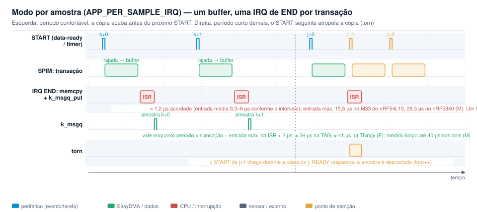

# gpiote_dppi_spim: acelerômetro lido no data-ready via GPIOTE → DPPI → SPIM

Exemplo recomendado: uma transação SPI por amostra nova, disparada pelo
pino de data-ready, sem CPU no caminho da aquisição.

## Visão geral

O pino INT do sensor vira um evento GPIOTE IN que, por DPPI, aciona
`SPIM.TASKS_START`; o CSN é do hardware e o EasyDMA grava a rajada em RAM.
É o único canal DPPI do exemplo: transações/s = amostras/s, sem TIMER,
HFXO nem repetidas. A CPU só entrega as amostras a uma `k_msgq`: no modo
drenado (padrão) uma thread esvazia o anel a cada T; no modo por amostra
(`APP_PER_SAMPLE_IRQ`) a IRQ de `END` copia cada rajada. Medido até
1 600 Hz com zero perdas no M33 e no FLPR, nos dois modos. Conceitos,
limites e roteiro de escolha no [README da raiz](../README.md).


| Caminho do dado | Evento → tarefa |
|---|---|
| Disparo | INT → GPIOTE IN → DPPI → `SPIM.TASKS_START` |
| Aquisição | SPIM (CSN por hardware) → EasyDMA → anel (`RX_POSTINC`) ou um buffer |
| Entrega, drenado | thread a cada T: head, `k_msgq_put`, arma o wrap; IRQ `DMA.RX.READY`/`STARTED` uma vez por volta: `PTR = slot 0` |
| Entrega, por amostra | IRQ `END`: copia o buffer, `k_msgq_put` |
| Partida | o data-ready é nível e já está alto: um `START` por software após ligar o DPPI |

## Requisitos

| Alvo (`-b`) | Sensor | Barramento | Data-ready |
|---|---|---|---|
| `thingy53/nrf5340/cpuapp` | ADXL362 | SPIM4 (única com CSN por hardware), P0.29/28/26, CSN P0.22 | INT1, P0.19 |
| `nrf54l15tag/nrf54l15/cpuapp` | BMI270 | SPIM22 (P1, PERI), CSN P1.07 | INT, P1.04 (GPIOTE20) |
| `nrf54l15tag/nrf54l15/cpuflpr` | BMI270 | SPIM22, mesmo código no RISC-V | INT, P1.04 |

nRF Connect SDK v3.4.1 (`nrfutil sdk-manager`); J-Link e log por RTT (a TAG
não tem UART; a Thingy é gravada pelo debug de uma DK).

## Configuração

| Kconfig | Default | Função |
|---|---|---|
| `APP_SENSOR_ADXL362` / `APP_SENSOR_BMI270` | pelo devicetree | backend (`src/sensor_*.c`) |
| `APP_SENSOR_ODR_HZ` | 400 | ODR = taxa de transações (ADXL362 ≤ 400 Hz, BMI270 ≤ 1600 Hz) |
| `APP_PER_SAMPLE_IRQ` | n | modo por amostra: um buffer, IRQ de `END`, `torn`; os três seguintes sem efeito |
| `APP_DRAIN_PERIOD_US` | 10000 | T (100 µs a 1 s); T real e latência: [raiz, Como escolher, passo 3](../README.md#como-escolher) |
| `APP_RING_SLOTS` | 256 | anel (8 a 4096) + 8 de guarda; regra no passo 3 |
| `APP_WRAP_AWAKE_BELOW_US` | 64 | espera o wrap acordada com amostras mais próximas que isso; 0 desliga |
| `APP_QUEUE_DEPTH` | 256 | `k_msgq`; regra no passo 3 |
| `APP_SPI_FREQ_HZ` | 4 MHz | clock da SPIM (8 MHz na TAG) |
| `APP_SPI_CSN_DURATION` / `APP_SPI_RX_DELAY` | 2 / −1 | `IFTIMING.CSNDUR` / `RXDELAY` (1 na TAG) |
| `APP_REPORT_PERIOD_MS` | 1000 | período do relatório |



RAM no modo drenado: (`APP_RING_SLOTS` + 8 + `APP_QUEUE_DEPTH`) × rajada =
8,8 KB (17 B), 5,7 KB (11 B).

| `chosen` | Uso |
|---|---|
| `app,accel` | nó do acelerômetro: pai = barramento, `cs-gpios` = CSN, `int1-gpios`/`irq-gpios` = data-ready e instância GPIOTE |

Thingy:53: o overlay move o ADXL362 da `spi3` para a `spi4` e acrescenta
`NRF_PSEL(SPIM_CSN, 0, 22)`; TAG: acrescenta o CSN ao `spi22_default` e
desliga os outros sensores do barramento.

### Detalhes do engine

O ponteiro do EasyDMA conta transações iniciadas: a drenagem entrega
`[tail, head − 1)` e, com até 4 pendentes, espera `XFER_SETTLE_US` (≈ 21 µs
para 17 B, 15 µs para 11 B) e entrega também o slot head − 1. `wrap_done` é
lido antes do head: um wrap entre as duas leituras fica para a drenagem
seguinte. A ISR do wrap limpa o evento, lê o head e escreve `PTR = slot 0`;
um `START` entre a limpeza e a escrita usa o slot k + 1, que é entregue ou
pulado (`late`), nunca dado antigo. Nas taxas altas a thread espera o wrap
acordada (`APP_WRAP_AWAKE_BELOW_US`, ≤ min(T/4, 8 períodos + 8 µs) ≈ 520 µs,
bloqueando as threads preemptíveis). No modo por amostra a ISR de `END`
copia o buffer e conta `torn` se um `START` chegou durante a cópia.

## Adicionar um sensor

| Peça | O que fazer |
|---|---|
| `src/sensor_<x>.c` | `init` (registradores, ODR), `enable_drdy_int` (data-ready no pino), descritor da rajada começando no `STATUS` (`burst_tx`, `fresh_offset`/`fresh_mask`), `decode` (bytes → m/s²) |
| Overlay | nó do sensor no barramento com `cs-gpios` (CSN por hardware, `NRF_PSEL(SPIM_CSN, …)` no pinctrl) e pino de data-ready; `chosen app,accel` |
| Kconfig | entrada na `choice APP_SENSOR` |
| Verificação | `xfers` no ODR, `fresh = queued`, `late = ovf = torn = 0`, Z variando |

| Sensor | Comando | Rajada | `fresh` | Notas |
|---|---|---|---|---|
| ADXL362 (M) | `0x0B` + endereço | 11 B: `STATUS`, `FIFO_ENTRIES` L/H, XYZ | `STATUS` bit 0 | Thingy:53, SPIM4 |
| BMI270 (M) | `0x83` (MSB 1: errata 8 → 8 MHz) | 17 B: dummy, `STATUS`, 8 B AUX, XYZ | `STATUS` bit 7 | *config file* de 328 B, leitura dummy para SPI |
| ADXL382 (não testado) | `(0x11 << 1) \| 1` = `0x23` | 11 B `STATUS0..ZDATA_L`, big-endian | `STATUS0` bit 0 (`fresh_mask 0x01`) | `DEVID_AD` 0xAD, `OP_MODE` 0x26 com ODR a confirmar, `DATA_READY` no INT0; binding `adi,adxl382.yaml`, overlay `adxl382@0`, `APP_SPI_FREQ_HZ = 16000000` na SPIM4, T = 1 ms; esperar `xfers` ≈ 64 000/s |

## Compilação e gravação

```
nrfutil sdk-manager toolchain launch --ncs-version v3.4.1 --chdir C:\ncs\v3.4.1 -- ^
  west build -s <repo>\gpiote_dppi_spim -d <build> -b <alvo> -p always ^
    [-- "-Dgpiote_dppi_spim_CONFIG_APP_SENSOR_ODR_HZ=1600" "-Dgpiote_dppi_spim_CONFIG_APP_PER_SAMPLE_IRQ=y"]
west flash -d <build> --dev-id <serial J-Link>
```

Kconfig com o prefixo da imagem, cada `-D` entre aspas no PowerShell. RTT
na Thingy:53: `"-Dgpiote_dppi_spim_EXTRA_CONF_FILE=<repo>\gpiote_dppi_spim\overlay-rtt.conf"`
(na TAG já está em `boards/*.conf`). Gravar e capturar:
`tools\flash_and_capture.ps1 -Build <build> -Out <log> -Serial <serial>
-Device <nRF54L15_M33|NRF5340_XXAA_APP> -Elf <zephyr.elf>` (o FLPR é lido
pela conexão M33; sysbuild com o `vpr_launcher` padrão).

## Teste

| Campo | Significado | Teste bom |
|---|---|---|
| `xfers` | transações iniciadas (voltas × anel + head; IRQs `END` no modo por amostra) | avança no ODR |
| `queued` / `fresh` | amostras pela fila / com data-ready ativo | iguais |
| `dropped` / `late` / `ovf` / `torn` | fila cheia / wraps tardios (limite superior de perdas) / voltas até a guarda / cópias atropeladas | 0 |

Borda de data-ready perdida para a aquisição com o pino alto; um watchdog
(`START` por software quando `xfers` não avança) não está implementado.

## Saída de exemplo

TAG, BMI270 a 1600 Hz, T = 10 ms (`test-logs/u_tag_int_drain10ms_1600.log`):

```
<inf> app: gpiote_dppi_spim: BMI270, trigger=data-ready pin, drain every 10000 us
<inf> spim_dppi: SPIM @0x500c8000, hardware CSN on pin 39, 8000000 Hz, CSNDUR 2, RXDELAY 1
<inf> bmi270: config upload: 328 bytes in 11 chunks, 23 ms; INIT_ADDR readback 0x0A00
<inf> spim_dppi: trigger: BMI270 data-ready on pin 36, rising edge -> GPIOTE IN event
<inf> spim_dppi: DPPI connected, burst 17 bytes, ring 256 slots, drain every 10000 us, wrap on DMA.RX.READY
<inf> app: t=3000 ms xfers=4832 queued=1608 fresh=1608 dropped=0 late=0 ovf=0 torn=0 Z avg=0.60 min=0.50 max=0.69 m/s^2
<inf> app: t=4000 ms xfers=6441 queued=1608 fresh=1608 dropped=0 late=0 ovf=0 torn=0 Z avg=0.59 min=0.47 max=0.70 m/s^2
```

Modo por amostra: banner `one interrupt per sample`, conexão `burst 17
bytes, one buffer, one END interrupt per sample`.

## Resultados

M, `test-logs/`. Drenado com T = 10 ms, anel 256, fila 256; por amostra com
fila 256. SCK 4 MHz na Thingy:53, 8 MHz na TAG. Todos com `queued = fresh`
e `dropped = late = ovf = torn = 0`.

| Alvo | ODR | Modo | Transações/s | Log |
|---|---|---|---|---|
| Thingy:53, ADXL362 | 400 Hz (real ≈ 372) | drenado | 372–374 (371–375 nas janelas) | `u_thingy_int_drain10ms.log` |
| Thingy:53, ADXL362 | 400 Hz | por amostra | 372–374 | `u_thingy_int_persample.log` |
| TAG M33, BMI270 | 1600 Hz (máximo) | drenado | **1608–1609** | `u_tag_int_drain10ms_1600.log` |
| TAG M33, BMI270 | 1600 Hz | por amostra | **1607–1609** | `u_tag_int_persample_1600.log` |
| TAG FLPR, BMI270 | 1600 Hz | drenado | **≈ 1607** (`xfers` +1614 por relatório de ≈ 1004 ms; `queued` alterna 1606–1607 / 1621–1622) | `u_tag_flpr_int_drain10ms_1600.log` |
| TAG FLPR, BMI270 | 1600 Hz | por amostra | **1607–1610** | `u_tag_flpr_int_persample_1600.log` |

Imagens (build): TAG M33 50 208 B (drenado) / 49 696 B (por amostra); FLPR
29 292 B em RAM. A 1600 Hz com T = 10 ms: 16 amostras por drenagem, wrap a
cada 8 drenagens (volta de 128), 112 IRQ/s; a mais nova de cada drenagem
sai na seguinte (≈ 10,7 ms), as outras em ≤ ≈ 10,07 ms. Tetos e limite do
modo por amostra: [`timer_dppi_spim`](../timer_dppi_spim/README.md#resultados).

## Achados

- Data-ready é nível nos dois sensores: sem uma primeira leitura a borda
  nunca vem; `START` por software após ligar o DPPI.
- nRF54L15, errata 8: CPHA = 0, `PRESCALER > 2`, MSB do comando em 1
  (`0x83`) corrompe o MOSI; workaround da nrfx incompatível com DPPI; 8 MHz
  (`0x0B` do ADXL362 e `0x23` do ADXL382 não são afetados).
- `IFTIMING.RXDELAY` no nRF54L é em ciclos de 16 MHz: reset (2) amostra o
  bit seguinte a 8 MHz; `APP_SPI_RX_DELAY=1`.
- Wrap logo após `STARTED`/`DMA.RX.READY`, nunca após `END`: escrever entre
  `END` e o `START` seguinte colidia com o hardware (MPU/BUS fault a 15 µs).
- Wrap a cada drenagem deixava a volta nova alcançar a anterior (`queued`
  > `fresh` em 1–5/s); armar em anel/2 corrigiu (revisão cega do log).
- nrfx deixa a IRQ de `STARTED` ligada ao armar o modo repetido (desligar
  todas); EasyDMA só lê RAM (prefixo TX copiado); GPIOTE compartilhado com
  o `gpio_nrfx` (`GPIOTE_NRFX_INST_BY_NODE`, `nrfx_gpiote_channel_alloc`);
  os sensores mantêm estado entre resets; o logger RTT precisa do endereço
  de `_SEGGER_RTT` do ELF.

## Dependências

nrfx 4.0: `nrfx_spim` (só no init; depois modo repetido com IRQs
desligadas), `nrfx_gpiote` (IN sem handler), `nrfx_gppi`, HALs `nrf_spim`
e `nrf_gpio`. Zephyr: `pinctrl`, `k_msgq`, thread cooperativa de drenagem
(`k_sleep`, `k_busy_wait`), log por RTT, `gpiote_nrfx.h`. Backends
`src/sensor_adxl362.c` e `src/sensor_bmi270.c`.
